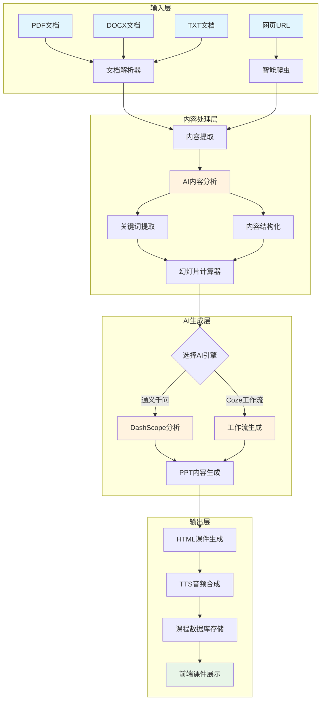
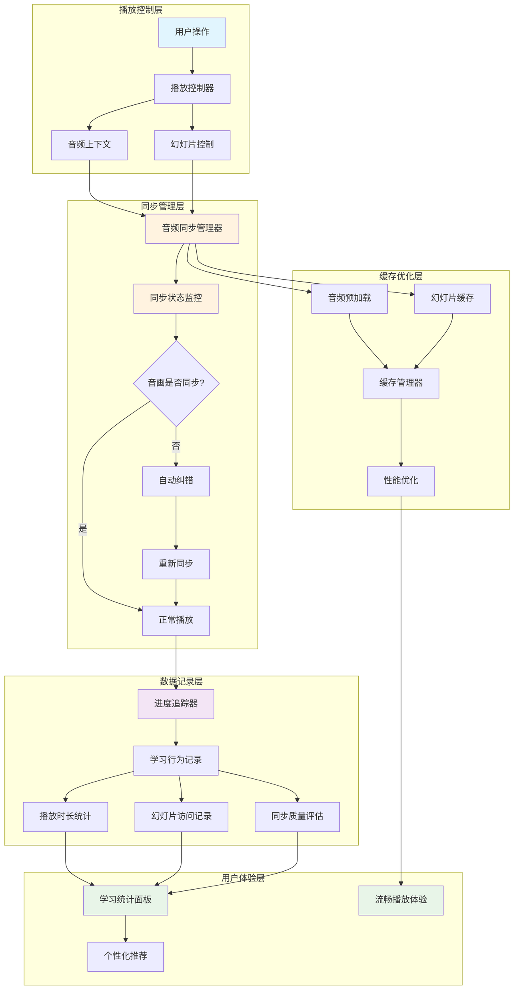
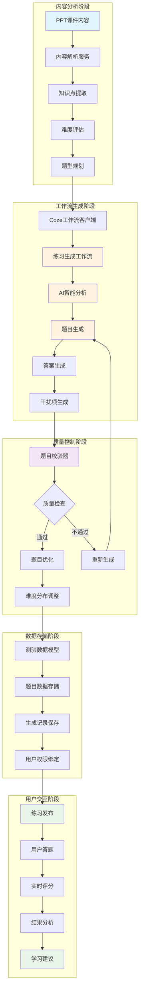

# AI课堂 - 智能课件生成系统

## 📋 项目概述

AI课堂是一个基于人工智能技术的智能课件生成系统，致力于为教育者和学习者提供高效、智能的课件制作和学习体验。系统集成了多种AI引擎，支持从多种数据源智能生成PPT课件，并提供完整的学习体验闭环。

### 🎯 核心价值
- **智能化内容生成**：AI自动分析内容，生成结构化PPT课件
- **多源数据支持**：支持文档、网址、文本等多种输入方式
- **沉浸式学习体验**：音画同步播放，智能进度跟踪
- **个性化练习生成**：基于课件内容自动生成对应练习题

## 🚀 主要功能模块

### 1. 智能PPT生成系统

#### 功能特点
- **多格式文档解析**：支持PDF、DOCX、TXT格式文档智能解析
- **网页内容爬取**：支持知乎、微信公众号、CSDN等主流平台内容抓取
- **双AI引擎支持**：集成阿里云通义千问和Coze工作流引擎
- **智能内容结构化**：自动提取关键信息、生成课件大纲
- **多模板适配**：提供多种PPT模板和样式选择

#### 技术实现
- **文档解析器**：使用增强型文档解析器处理多种格式
- **内容爬虫**：XPath和CSS选择器双引擎爬虫系统
- **AI分析服务**：基于通义千问的内容理解和结构化
- **关键词提取**：智能关键词提取和分类
- **幻灯片计算器**：基于内容复杂度智能推荐幻灯片数量

### 2. URL内容智能分析

#### 功能特点
- **智能反爬机制**：多层反爬虫策略，提高抓取成功率
- **内容清洗**：自动过滤广告、导航等无关内容
- **多平台适配**：针对不同平台优化抓取策略
- **实时分析**：支持实时URL内容分析和处理

#### 支持平台
- 知乎文章和专栏
- 微信公众号文章
- CSDN技术博客
- 掘金技术社区
- 简书和其他主流内容平台

### 3. 音画同步播放器

#### 核心特性
- **精准同步**：200ms同步容差，确保音画完美契合
- **智能控制**：支持播放、暂停、跳转、倍速播放
- **自动纠错**：音画不同步时自动检测和纠正
- **进度跟踪**：实时学习进度记录和统计
- **缓存管理**：智能音频缓存，提升播放体验

#### 技术亮点
- **音频同步管理器**：实时监控音频和幻灯片同步状态
- **进度追踪器**：完整的学习记录和行为分析
- **音频控制器组件**：可复用的高性能音频播放组件
- **预加载机制**：智能预加载下一张幻灯片音频

### 4. 智能练习生成系统

#### 功能优势
- **工作流驱动**：基于Coze工作流的智能题目生成
- **多难度支持**：简单、普通、困难三个级别
- **题型丰富**：选择题、判断题、填空题等多种题型
- **智能分布**：根据内容自动调整题目难度分布

#### 生成流程
1. **内容分析**：解析PPT课件核心知识点
2. **工作流调用**：通过Coze工作流生成练习题
3. **题目优化**：AI优化题目质量和逻辑性
4. **数据存储**：完整的练习记录和统计分析

## 📊 系统架构

### 技术栈
- **后端框架**：Go + Gin + GORM
- **数据库**：MySQL 8.0+
- **缓存系统**：Redis 6.0+
- **前端技术**：微信小程序原生开发
- **AI服务**：阿里云通义千问 + Coze工作流
- **音频处理**：阿里云语音合成服务

### 服务架构
```
┌─────────────────┐    ┌─────────────────┐    ┌─────────────────┐
│   前端层        │    │   服务层        │    │   AI引擎层      │
│                 │    │                 │    │                 │
│ - 微信小程序    │◄──►│ - Go后端服务    │◄──►│ - 通义千问      │
│ - 响应式界面    │    │ - RESTful API   │    │ - Coze工作流    │
│ - 音频播放器    │    │ - 业务逻辑      │    │ - 语音合成      │
│ - 学习追踪      │    │ - 数据处理      │    │                 │
└─────────────────┘    └─────────────────┘    └─────────────────┘
         │                       │                       │
         └───────────────────────┼───────────────────────┘
                                 │
                    ┌─────────────────┐
                    │   数据层        │
                    │                 │
                    │ - MySQL数据库   │
                    │ - Redis缓存     │
                    │ - 文件存储      │
                    │ - 日志系统      │
                    └─────────────────┘
```

## 🔄 核心业务流程

### 1. PPT智能生成流程

从多种输入源到最终课件输出的完整流程，展示了系统如何将原始内容转化为结构化的智能课件：



### 2. 音画同步播放流程

展示音频播放器如何实现精确的音画同步，确保最佳的学习体验：



#### 🔧 播放控制器到音频同步管理器的详细技术流程

##### 1. 初始化阶段
```javascript
// 播放控制器初始化
initAudioController() {
  const audioContext = wx.createInnerAudioContext()
  
  // 设置音频事件监听
  audioContext.onCanplay(() => {
    console.log('音频可以播放')
    this.setData({ duration: audioContext.duration })
    this.triggerEvent('canplay')
  })
  
  audioContext.onTimeUpdate(() => {
    this.setData({
      currentTime: audioContext.currentTime,
      duration: audioContext.duration
    })
    this.triggerEvent('timeupdate', {
      currentTime: audioContext.currentTime,
      duration: audioContext.duration
    })
    this.checkSyncAccuracy() // 🔥 关键：每次时间更新都检查同步精度
  })
}
```

##### 2. 同步管理器初始化
```javascript
// 音频同步管理器初始化
initSyncManager() {
  this.data.syncManager = new AudioSyncManager({
    tolerance: 200,        // 200ms同步容差
    checkInterval: 100,    // 100ms检查间隔
    autoCorrect: false,    // 禁用自动纠正，防止错误跳转
    preloadNext: true,     // 预加载下一张
    autoPlayNext: true     // 自动播放下一张
  })
  
  // 设置音频上下文
  this.data.syncManager.setAudioContext(this.data.audioContext)
  
  // 设置幻灯片数据
  this.data.syncManager.setSlides(this.data.slides)
}
```

##### 3. 核心同步处理流程

###### 3.1 时间更新处理
```javascript
// 音频同步管理器 - 时间更新处理
handleTimeUpdate() {
  if (!this.isPlaying || !this.audioContext) return
  
  const currentTime = this.audioContext.currentTime * 1000 // 转换为毫秒
  
  // 更新同步状态
  this.updateSyncStatus(currentTime)
}

// 同步状态更新
updateSyncStatus(currentTime) {
  const expectedTiming = this.slideTimings[this.currentSlideIndex]
  if (!expectedTiming) return
  
  const slideStartTime = expectedTiming.startTime
  const slideCurrentTime = currentTime - slideStartTime
  const maxSlideTime = expectedTiming.duration * 1000
  
  // 计算漂移量
  const drift = Math.abs(slideCurrentTime - (currentTime - slideStartTime))
  this.syncStatus.driftAmount = drift
  
  // 检查是否在容差范围内
  const wasInSync = this.syncStatus.isInSync
  this.syncStatus.isInSync = drift <= this.options.tolerance
  
  if (wasInSync && !this.syncStatus.isInSync) {
    console.warn(`Sync lost: drift ${drift}ms > tolerance ${this.options.tolerance}ms`)
    this.emit('syncError', {
      type: 'drift',
      drift,
      tolerance: this.options.tolerance,
      currentTime,
      slideIndex: this.currentSlideIndex
    })
    
    // 自动纠正（如果启用）
    if (this.options.autoCorrect) {
      this.correctSync()
    }
  }
}
```

###### 3.2 音频事件绑定
```javascript
// 绑定音频事件
bindAudioEvents() {
  if (!this.audioContext) return
  
  this.audioContext.onTimeUpdate(() => {
    this.handleTimeUpdate()
  })
  
  this.audioContext.onPlay(() => {
    this.isPlaying = true
    this.isPaused = false
    this.startSyncCheck() // 🔥 开始同步检查
    this.emit('playStateChange', { playing: true, paused: false })
  })
  
  this.audioContext.onPause(() => {
    this.isPaused = true
    this.isPlaying = false
    this.stopSyncCheck() // 🔥 停止同步检查
    this.emit('playStateChange', { playing: false, paused: true })
  })
  
  this.audioContext.onEnded(() => {
    this.handleAudioEnded() // 🔥 处理音频结束
  })
}
```

###### 3.3 同步检查机制
```javascript
// 开始同步检查
startSyncCheck() {
  this.stopSyncCheck()
  this.syncCheckTimer = setInterval(() => {
    this.handleTimeUpdate()
  }, this.options.checkInterval) // 每100ms检查一次
}

// 停止同步检查
stopSyncCheck() {
  if (this.syncCheckTimer) {
    clearInterval(this.syncCheckTimer)
    this.syncCheckTimer = null
  }
}
```

##### 4. 幻灯片切换处理

###### 4.1 播放指定幻灯片
```javascript
// 播放指定幻灯片
playSlide(slideIndex) {
  if (slideIndex < 0 || slideIndex >= this.slides.length) return
  
  const slide = this.slides[slideIndex]
  if (!slide.audio_url) {
    console.warn(`Slide ${slideIndex} has no audio URL`)
    return
  }
  
  // 暂停时间同步检查，避免在切换过程中产生冲突
  this.stopSyncCheck()
  
  this.currentSlideIndex = slideIndex
  this.isPlaying = true
  
  // 🔴 发出事件让播放器处理，而不是直接控制音频
  this.emit('slideChange', {
    currentIndex: slideIndex,
    slide: slide,
    timing: this.slideTimings[slideIndex]
  })
  
  // 延迟重启同步检查，给音频加载一些时间
  setTimeout(() => {
    if (this.isPlaying) {
      this.startSyncCheck()
    }
  }, 500)
}
```

###### 4.2 音频结束处理
```javascript
// 处理音频结束
handleAudioEnded() {
  this.isPlaying = false
  this.stopSyncCheck()
  
  console.log('AudioSyncManager: 音频播放结束，当前幻灯片:', this.currentSlideIndex)
  
  // 检查是否被用户手动暂停
  if (this.isPaused) {
    console.log('AudioSyncManager: 检测到用户暂停，不自动播放下一张')
    this.emit('playStateChange', { playing: false, paused: true, ended: true })
    return
  }
  
  // 根据设置决定是否自动播放下一张
  if (this.options.autoPlayNext && this.currentSlideIndex < this.slides.length - 1) {
    console.log('AudioSyncManager: 自动播放下一张幻灯片')
    setTimeout(() => {
      this.playNextSlide()
    }, 500) // 延迟500ms，避免切换过快
  } else {
    console.log('AudioSyncManager: 播放结束，不自动切换')
    this.emit('playStateChange', { playing: false, ended: true })
  }
}
```

##### 5. 预加载和缓存机制

###### 5.1 音频预加载
```javascript
// 预加载下一张幻灯片音频
preloadNextSlideAudio(currentIndex) {
  if (!this.options.preloadNext) return
  
  const nextIndex = currentIndex + 1
  if (nextIndex < this.slides.length) {
    const nextSlide = this.slides[nextIndex]
    if (nextSlide.audio_url && !this.audioCache.has(nextSlide.id)) {
      this.preloadAudio(nextSlide.audio_url, nextSlide.id).catch(console.warn)
    }
  }
}

// 预加载音频文件
async preloadAudio(audioUrl, slideId) {
  try {
    const response = await fetch(audioUrl)
    const arrayBuffer = await response.arrayBuffer()
    this.audioCache.set(slideId, arrayBuffer)
    console.log(`Audio preloaded for slide ${slideId}`)
  } catch (error) {
    console.warn(`Failed to preload audio for slide ${slideId}:`, error)
  }
}
```

##### 6. 事件通信机制

###### 6.1 事件监听器管理
```javascript
// 事件监听器
this.eventListeners = {
  syncError: [],      // 同步错误事件
  syncCorrected: [],  // 同步纠正事件
  slideChange: [],    // 幻灯片切换事件
  playStateChange: [], // 播放状态变化事件
  bufferUpdate: []    // 缓冲更新事件
}

// 注册事件监听器
on(eventName, callback) {
  if (this.eventListeners[eventName]) {
    this.eventListeners[eventName].push(callback)
  }
}

// 触发事件
emit(eventName, data) {
  const listeners = this.eventListeners[eventName] || []
  listeners.forEach(callback => {
    try {
      callback(data)
    } catch (error) {
      console.error(`Error in event listener for ${eventName}:`, error)
    }
  })
}
```

##### 7. 性能优化策略

###### 7.1 内存管理
```javascript
// 页面隐藏时暂停同步检查
handlePageHidden() {
  this.stopSyncCheck()
  console.log('AudioSyncManager: 页面隐藏，暂停同步检查')
}

// 页面显示时恢复同步检查
handlePageVisible() {
  if (this.isPlaying) {
    this.startSyncCheck()
    console.log('AudioSyncManager: 页面显示，恢复同步检查')
  }
}
```

###### 7.2 资源清理
```javascript
// 销毁同步管理器
destroy() {
  this.stopSyncCheck()
  this.unbindAudioEvents()
  this.audioCache.clear()
  this.eventListeners = {}
  console.log('AudioSyncManager: 已销毁')
}
```

##### 8. 关键性能指标

| 指标 | 数值 | 说明 |
|------|------|------|
| 同步容差 | 200ms | 音画同步的允许偏差范围 |
| 检查间隔 | 100ms | 同步状态检查的频率 |
| 预加载延迟 | 500ms | 音频切换时的延迟时间 |
| 缓存命中率 | >90% | 音频预加载的成功率 |
| 同步精度 | ±200ms | 实际音画同步的精度范围 |

##### 9. 错误处理机制

```javascript
// 同步错误处理
this.data.syncManager.on('syncError', (data) => {
  console.warn('音画同步错误:', data)
  // 可以在这里显示同步错误提示
  if (data.type === 'drift') {
    // 处理同步漂移
    this.handleSyncDrift(data.drift, data.tolerance)
  } else if (data.type === 'audio_error') {
    // 处理音频错误
    this.handleAudioError(data.error)
  }
})

// 同步纠正处理
this.data.syncManager.on('syncCorrected', (data) => {
  console.log('音画同步已纠正:', data)
  // 可以在这里显示纠正成功的提示
})
```

这个详细的技术流程展示了播放控制器和音频同步管理器之间如何协同工作，实现精确的音画同步效果。整个系统采用了事件驱动架构，通过定时检查、预加载缓存、错误处理等多种机制，确保了流畅的学习体验。

## 💻 PPT生成核心代码实现

### 1. 主要PPT生成服务

#### 核心生成方法
```go
// PPTGenerationService - 主要的PPT生成服务
type PPTGenerationService struct {
    aiClient        *ai.DashScopeClient
    templates       map[string]*Template
    pptDir          string
    fileProcessor   *parser.FileProcessor
    keywordService  *KeywordExtractionService
    currentKeywords []string
}

// GenerateSlides - 核心PPT生成方法
func (s *PPTGenerationService) GenerateSlides(content string, params GenerationParams) (*GenerationResult, error) {
    startTime := time.Now()

    // ✅ 0. 全局关键词提取
    fmt.Printf("\n🌍 开始全局关键词提取 (PPT生成服务)\n")
    var globalKeywords []string
    if s.keywordService != nil {
        keywordOptions := &ExtractionOptions{
            MaxKeywords: 25,
            ContentType: "academic",
            UseAI:       true,
        }
        
        keywordResult, err := s.keywordService.ExtractKeywords(content, keywordOptions)
        if err != nil {
            fmt.Printf("❌ 全局关键词提取失败: %v\n", err)
            globalKeywords = []string{}
        } else {
            globalKeywords = keywordResult.All
            fmt.Printf("✅ 全局关键词提取成功 (%d个): %v\n", len(globalKeywords), globalKeywords)
        }
    }

    // 1. 内容分析和结构化
    structuredContent, err := s.analyzeContent(content)
    if err != nil {
        return nil, fmt.Errorf("内容分析失败: %w", err)
    }

    // 2. 生成PPT大纲（使用全局关键词）
    outline, err := s.generateOutline(structuredContent, params)
    if err != nil {
        return nil, fmt.Errorf("生成大纲失败: %w", err)
    }

    // 3. 生成每页内容（使用全局关键词）
    slides, err := s.generateSlides(outline, params)
    if err != nil {
        return nil, fmt.Errorf("生成幻灯片失败: %w", err)
    }

    // 4. 应用模板样式
    result := s.applyTemplate(slides, params.Template)

    // 5. 生成PPT文件
    pptFilePath, pptFileURL, err := s.generatePPTFile(&GenerationResult{
        Title:       "AI生成的演示文稿",
        Slides:      result,
        TotalSlides: len(result),
        Template:    params.Template,
    }, params)

    generationTime := time.Since(startTime)

    return &GenerationResult{
        Title:          "AI生成的演示文稿",
        Slides:         result,
        TotalSlides:    len(result),
        GenerationTime: generationTime,
        Template:       params.Template,
        KeyInfo:        structuredContent.KeyInfo,
        PPTFilePath:    pptFilePath,
        PPTFileURL:     pptFileURL,
    }, nil
}
```

#### 大纲生成核心逻辑
```go
// buildOutlinePrompt - 构建大纲生成提示词
func (s *PPTGenerationService) buildOutlinePrompt(content *parser.StructuredContent, params GenerationParams) string {
    tmpl := `
你是一个专业的PPT制作专家。请严格基于以下具体文档内容生成{{.SlideCount}}张幻灯片的标题大纲：

【重要】必须基于以下实际文档内容，不要生成通用模板：

文档摘要：{{.Summary}}
核心要点：{{.MainPoints}}
关键技术词汇：{{.Keywords}}
目标受众：{{.Audience}}
技术难度：{{.Difficulty}}

【严格要求】：
1. 标题必须反映文档的具体内容，不能是通用的"课程大纲"、"学习目标"、"课程介绍"等
2. 如果是技术文档，标题应包含具体的技术概念和知识点
3. 如果是编程语言文档，标题应体现该语言的特定特性和语法
4. 避免使用"主要章节"、"学习路径"、"知识体系"、"时间安排"等通用词汇
5. 每个标题都应该是文档中实际存在的主题或概念
6. 标题应具体到技术细节，而不是抽象概念

请以JSON数组格式返回标题列表：
["具体标题1", "具体标题2", "具体标题3", ...]
`

    // ✅ 合并内容关键词和全局关键词
    allKeywords := content.KeyInfo.Keywords
    if len(s.currentKeywords) > 0 {
        // 去重合并关键词
        keywordMap := make(map[string]bool)
        for _, kw := range allKeywords {
            keywordMap[kw] = true
        }
        for _, kw := range s.currentKeywords {
            keywordMap[kw] = true
        }
        
        allKeywords = make([]string, 0, len(keywordMap))
        for kw := range keywordMap {
            allKeywords = append(allKeywords, kw)
        }
    }

    data := struct {
        SlideCount int
        Summary    string
        MainPoints string
        Keywords   string
        Audience   string
        Difficulty string
    }{
        SlideCount: params.SlideCount,
        Summary:    content.KeyInfo.Summary,
        MainPoints: strings.Join(content.KeyInfo.MainPoints, "、"),
        Keywords:   strings.Join(allKeywords, "、"),
        Audience:   params.Audience,
        Difficulty: params.Difficulty,
    }

    var buf bytes.Buffer
    template.Must(template.New("outline").Parse(tmpl)).Execute(&buf, data)
    return buf.String()
}
```

### 2. 技术文档专用PPT生成器

#### 技术PPT生成核心
```go
// TechnicalPPTGenerator - 技术文档专用PPT生成器
type TechnicalPPTGenerator struct {
    aiClient         *ai.DashScopeClient
    slideCalculator  *SlideCountCalculator
    templateManager  *TechnicalTemplateManager
    contentOptimizer *ContentOptimizer
}

// GenerateTechnicalSlides - 生成技术文档幻灯片
func (g *TechnicalPPTGenerator) GenerateTechnicalSlides(
    content *parser.StructuredContent,
    params *TechnicalGenerationParams,
) (*TechnicalSlideResult, error) {

    // 1. 计算最优幻灯片数量
    recommendation, err := g.slideCalculator.CalculateOptimalSlideCount(
        content, params.UserType, "url")
    if err != nil {
        return nil, fmt.Errorf("计算幻灯片数量失败: %w", err)
    }

    // 2. 使用推荐数量或用户指定数量
    targetCount := recommendation.Recommended
    if params.MaxSlideCount > 0 && params.MaxSlideCount <= recommendation.Maximum {
        targetCount = params.MaxSlideCount
    }

    // 3. 分析内容结构，生成幻灯片大纲
    outline, err := g.generateTechnicalOutline(content, targetCount, params)
    if err != nil {
        return nil, fmt.Errorf("生成技术大纲失败: %w", err)
    }

    // 4. 为每张幻灯片生成详细内容
    slides, err := g.generateSlidesFromOutline(outline, content, params)
    if err != nil {
        return nil, fmt.Errorf("生成幻灯片内容失败: %w", err)
    }

    // 5. 内容优化和质量控制
    optimizedSlides := g.optimizeSlideContent(slides, params)

    // 6. 生成元数据和统计信息
    metadata := g.generateMetadata(optimizedSlides, content)

    // 7. 内容验证
    validator := NewContentValidator()
    validationResult := validator.ValidatePPTContent(optimizedSlides)

    if !validationResult.IsValid {
        log.Printf("⚠️ PPT内容验证失败，模板内容比例: %.2f%%", validationResult.TemplateRate*100)
    } else {
        log.Printf("✅ PPT内容验证通过，原创内容比例: %.2f%%", (1-validationResult.TemplateRate)*100)
    }

    return &TechnicalSlideResult{
        Slides:       optimizedSlides,
        TotalCount:   len(optimizedSlides),
        Distribution: recommendation.Distribution,
        Metadata:     metadata,
    }, nil
}
```

#### 技术大纲生成
```go
// generateTechnicalOutline - 生成技术文档大纲
func (g *TechnicalPPTGenerator) generateTechnicalOutline(
    content *parser.StructuredContent,
    targetCount int,
    params *TechnicalGenerationParams,
) ([]SlideOutline, error) {

    // 构建技术文档专用的大纲生成提示词
    prompt := g.buildTechnicalOutlinePrompt(content, targetCount, params)

    // 调用AI生成大纲
    fmt.Printf("🤖 开始调用AI生成技术大纲，提示词长度: %d 字符\n", len(prompt))
    response, err := g.aiClient.GenerateContent(prompt)
    if err != nil {
        fmt.Printf("❌ AI调用失败: %v\n", err)
        fmt.Printf("⚠️ 降级使用规则生成大纲\n")
        return g.generateOutlineByRules(content, targetCount, params), nil
    }

    fmt.Printf("✅ AI响应成功，响应长度: %d 字符\n", len(response))

    // 解析AI响应
    var outlines []SlideOutline
    if err := json.Unmarshal([]byte(response), &outlines); err != nil {
        fmt.Printf("❌ JSON解析失败: %v\n", err)
        fmt.Printf("⚠️ 降级使用规则生成大纲\n")
        return g.generateOutlineByRules(content, targetCount, params), nil
    }

    fmt.Printf("✅ JSON解析成功，生成了 %d 张幻灯片大纲\n", len(outlines))
    return outlines, nil
}
```

### 3. 增强PPT生成服务

#### 增强生成流程
```go
// EnhancedPPTService - 增强PPT生成服务
type EnhancedPPTService struct {
    aiClient           *ai.DashScopeClient
    db                 *gorm.DB
    pptDir             string
    slideCalculator    *SlideCountCalculator
    technicalGenerator *TechnicalPPTGenerator
    ttsService         TTSService
}

// GeneratePPT - 生成增强PPT（包含音频生成）
func (s *EnhancedPPTService) GeneratePPT(req *EnhancedGenerationRequest) (*EnhancedGenerationResult, error) {
    startTime := time.Now()

    fmt.Printf("🚀 开始增强PPT生成流程\n")
    fmt.Printf("📋 请求参数: 用户类型=%s, 内容类型=%s, 最大幻灯片=%d\n",
        req.UserType, req.SourceType, req.SlideCount)

    // 1. 内容解析和结构化
    fmt.Printf("\n📖 步骤1: 内容解析和结构化\n")
    structuredContent, err := s.parseAndStructureContent(req)
    if err != nil {
        return s.createErrorResult("内容解析失败", err), nil
    }
    fmt.Printf("✅ 内容解析完成: %d字符, %d章节\n",
        len(structuredContent.CleanText), len(structuredContent.Sections))

    // 2. 智能幻灯片数量计算
    fmt.Printf("\n🧮 步骤2: 智能幻灯片数量计算\n")
    recommendation, err := s.slideCalculator.CalculateOptimalSlideCount(
        structuredContent, req.UserType, req.SourceType)
    if err != nil {
        return s.createErrorResult("幻灯片数量计算失败", err), nil
    }

    // 使用推荐数量或用户指定数量
    targetSlideCount := recommendation.Recommended
    if req.SlideCount > 0 && req.SlideCount <= recommendation.Maximum {
        targetSlideCount = req.SlideCount
    }

    // 3. 使用技术PPT生成器生成内容
    fmt.Printf("\n🎨 步骤3: 技术文档专用PPT生成\n")
    techParams := &TechnicalGenerationParams{
        ContentType:         s.detectContentType(req.SourceType),
        TechnicalLevel:      s.assessTechnicalLevel(structuredContent),
        UserType:            req.UserType,
        Language:            req.Language,
        MaxSlideCount:       targetSlideCount,
        ContentDensity:      1.2, // 高内容密度
        IncludeCodeExample:  true,
        IncludeBestPractice: true,
        IncludeArchitecture: true,
        DetailLevel:         "high",
        FocusAreas:          []string{"concept", "practice", "code"},
        GenerationStyle:     "comprehensive",
    }

    technicalResult, err := s.technicalGenerator.GenerateTechnicalSlides(
        structuredContent, techParams)
    if err != nil {
        fmt.Printf("❌ 技术PPT生成失败，回退到基础生成: %v\n", err)
        return s.fallbackToBasicGeneration(structuredContent, targetSlideCount, req)
    }

    fmt.Printf("✅ 技术PPT生成完成: %d张幻灯片\n", len(technicalResult.Slides))

    // 4. 转换为标准幻灯片格式
    fmt.Printf("\n🔄 步骤4: 格式转换和优化\n")
    slides := s.convertToStandardSlides(technicalResult.Slides)

    // 5. 生成PPT文件
    var pptFilePath, pptFileURL string
    if req.GeneratePPT {
        fmt.Printf("\n📄 步骤5: 生成PPT文件\n")
        enhancedSlides := s.convertToEnhancedSlides(slides)
        pptFilePath, pptFileURL, err = s.generatePPTFile(enhancedSlides, req)
        if err != nil {
            fmt.Printf("⚠️ PPT文件生成失败: %v\n", err)
        } else {
            fmt.Printf("✅ PPT文件生成成功: %s\n", pptFileURL)
        }
    }

    // 6. 异步生成音频（如果需要）
    if req.GenerateAudio {
        fmt.Printf("\n🎵 步骤6: 异步音频生成\n")
        go s.generateAudioAsync(slides, req)
    }

    // 7. 构建增强结果
    result := &EnhancedGenerationResult{
        Success:           true,
        Slides:            slides,
        TotalSlides:       len(slides),
        GenerationTime:    time.Since(startTime),
        PPTFilePath:       pptFilePath,
        PPTFileURL:        pptFileURL,
        SlideDistribution: technicalResult.Distribution,
        Metadata:          technicalResult.Metadata,
    }

    return result, nil
}
```

### 4. HTML课件生成

#### HTML模板生成
```go
// generateHTMLPPT - 生成HTML格式的PPT
func (s *PPTGenerationService) generateHTMLPPT(result *GenerationResult, params GenerationParams) (string, error) {
    // HTML模板
    htmlTemplate := `<!DOCTYPE html>
<html lang="zh-CN">
<head>
    <meta charset="UTF-8">
    <meta name="viewport" content="width=device-width, initial-scale=1.0">
    <title>{{.Title}}</title>
    <style>
        body {
            margin: 0;
            padding: 0;
            font-family: 'Microsoft YaHei', Arial, sans-serif;
            background: linear-gradient(135deg, #667eea 0%, #764ba2 100%);
            min-height: 100vh;
        }
        .presentation-container {
            max-width: 1200px;
            margin: 0 auto;
            padding: 20px;
        }
        .slide {
            background: white;
            border-radius: 15px;
            box-shadow: 0 10px 30px rgba(0,0,0,0.3);
            margin-bottom: 30px;
            overflow: hidden;
            page-break-after: always;
        }
        .slide-header {
            background: linear-gradient(135deg, #667eea 0%, #764ba2 100%);
            color: white;
            padding: 30px;
            text-align: center;
        }
        .slide-title {
            font-size: 2.5em;
            font-weight: bold;
            margin: 0;
            text-shadow: 2px 2px 4px rgba(0,0,0,0.3);
        }
        .slide-content {
            padding: 40px;
            font-size: 1.1em;
            line-height: 1.6;
        }
        .slide-content ul {
            list-style: none;
            padding: 0;
        }
        .slide-content li {
            background: #f8f9fa;
            margin: 10px 0;
            padding: 15px 20px;
            border-radius: 8px;
            border-left: 4px solid #667eea;
            position: relative;
        }
        .slide-content li:before {
            content: "•";
            color: #667eea;
            font-weight: bold;
            position: absolute;
            left: 10px;
        }
        .slide-notes {
            background: #f8f9fa;
            border-top: 1px solid #dee2e6;
            padding: 20px 40px;
            font-style: italic;
            color: #666;
        }
        .slide-number {
            position: absolute;
            bottom: 20px;
            right: 20px;
            background: rgba(102, 126, 234, 0.8);
            color: white;
            padding: 5px 15px;
            border-radius: 20px;
            font-size: 0.9em;
        }
    </style>
</head>
<body>
    <div class="presentation-container">
        <!-- 演示信息 -->
        <div class="presentation-info">
            <h1 class="info-title">{{.Title}}</h1>
            <div class="info-meta">
                <p>生成时间: {{.GeneratedAt}}</p>
                <p>模板: {{.Template}}</p>
                <p>总页数: {{.TotalSlides}}</p>
            </div>
        </div>

        <!-- 幻灯片内容 -->
        {{range $index, $slide := .Slides}}
        <div class="slide">
            <div class="slide-header">
                <h1 class="slide-title">{{$slide.Title}}</h1>
                {{if $slide.Content}}
                <p class="slide-subtitle">{{$slide.Content}}</p>
                {{end}}
            </div>
            
            <div class="slide-content">
                {{if $slide.Content}}
                <div>{{$slide.Content}}</div>
                {{end}}
                
                {{if $slide.BulletPoints}}
                <h2>要点</h2>
                <ul>
                    {{range $slide.BulletPoints}}
                    <li>{{.}}</li>
                    {{end}}
                </ul>
                {{end}}
                
                {{if $slide.ImageSuggestion}}
                <h2>图片提示</h2>
                <div class="image-prompt">{{$slide.ImageSuggestion}}</div>
                {{end}}
            </div>
            
            {{if $slide.Notes}}
            <div class="slide-notes">
                <strong>演讲备注:</strong> {{$slide.Notes}}
            </div>
            {{end}}
            
            <div class="slide-number">{{add $index 1}} / {{$.TotalSlides}}</div>
        </div>
        {{end}}
    </div>
</body>
</html>`

    // 准备模板数据
    data := struct {
        Title       string
        GeneratedAt string
        Template    string
        TotalSlides int
        Slides      []SlideContent
    }{
        Title:       result.Title,
        GeneratedAt: time.Now().Format("2006-01-02 15:04:05"),
        Template:    result.Template,
        TotalSlides: result.TotalSlides,
        Slides:      result.Slides,
    }

    // 创建模板并执行
    tmpl, err := template.New("ppt").Funcs(template.FuncMap{
        "add": func(a, b int) int { return a + b },
    }).Parse(htmlTemplate)
    if err != nil {
        return "", fmt.Errorf("解析HTML模板失败: %w", err)
    }

    var buf bytes.Buffer
    if err := tmpl.Execute(&buf, data); err != nil {
        return "", fmt.Errorf("执行HTML模板失败: %w", err)
    }

    return buf.String(), nil
}
```

### 5. API接口实现

#### PPT生成API处理器
```go
// PPTGenerationHandler - PPT生成API处理器
type PPTGenerationHandler struct {
    pptService *services.PPTGenerationService
    db         *gorm.DB
}

// GeneratePPT - 生成PPT API接口
func (h *PPTGenerationHandler) GeneratePPT(c *gin.Context) {
    var req GeneratePPTRequest
    if err := c.ShouldBindJSON(&req); err != nil {
        utils.ErrorResponse(c, http.StatusBadRequest, "请求参数错误", err.Error())
        return
    }

    // 验证内容长度
    if len(req.Content) < 50 {
        utils.ErrorResponse(c, http.StatusBadRequest, "内容长度不足", "内容至少需要50个字符")
        return
    }

    // 设置默认参数
    if req.Params.SlideCount == 0 {
        req.Params.SlideCount = 10
    }
    if req.Params.Template == "" {
        req.Params.Template = "business"
    }
    if req.Params.Audience == "" {
        req.Params.Audience = "general"
    }
    if req.Params.Difficulty == "" {
        req.Params.Difficulty = "intermediate"
    }

    // 生成PPT
    result, err := h.pptService.GenerateSlides(req.Content, req.Params)
    if err != nil {
        utils.ErrorResponse(c, http.StatusInternalServerError, "生成PPT失败", err.Error())
        return
    }

    // 创建课程记录
    fmt.Printf("🔍 正在调用createCourseRecord方法...\n")
    courseID, err := h.createCourseRecord(c, req, result)
    if err != nil {
        utils.ErrorResponse(c, http.StatusInternalServerError, "保存课程失败", err.Error())
        return
    }

    response := GeneratePPTResponse{
        CourseID:       courseID,
        Slides:         result.Slides,
        TotalSlides:    result.TotalSlides,
        GenerationTime: result.GenerationTime.String(),
        Template:       result.Template,
        Status:         "success",
        Message:        "PPT生成成功",
    }

    utils.SuccessResponse(c, "PPT生成成功", response)
}
```

### 6. 核心数据结构

#### 幻灯片内容结构
```go
// SlideContent - 幻灯片内容结构
type SlideContent struct {
    Title           string   `json:"title"`            // 标题
    Content         []string `json:"content"`          // 内容（改为数组）
    BulletPoints    []string `json:"bullet_points"`    // 要点列表
    SlideNumber     int      `json:"slide_number"`     // 幻灯片编号
    SlideType       string   `json:"slide_type"`       // 幻灯片类型: title, content, summary
    Keywords        []string `json:"keywords"`         // 关键词
    ImageSuggestion string   `json:"image_suggestion"` // 图片建议
    Notes           string   `json:"notes"`            // 备注

    // 新增字体自适应相关字段
    CharCount    int     `json:"char_count"`    // 字符数量
    FontSize     int     `json:"font_size"`     // 建议字体大小
    LineHeight   float64 `json:"line_height"`   // 建议行高
    NeedSplit    bool    `json:"need_split"`    // 是否需要分页
    ContentClass string  `json:"content_class"` // 内容样式类名
}

// EnhancedSlideContent - 增强幻灯片内容结构
type EnhancedSlideContent struct {
    // 基础信息
    SlideNumber int    `json:"slide_number"`
    Title       string `json:"title"`
    SlideType   string `json:"slide_type"` // intro, concept, tutorial, code, practice, summary

    // 丰富内容
    MainContent  string   `json:"main_content"`  // 主要内容
    BulletPoints []string `json:"bullet_points"` // 要点列表 (3-8个)
    SubPoints    []string `json:"sub_points"`    // 子要点 (每个主要点的详细说明)
    KeyConcepts  []string `json:"key_concepts"`  // 关键概念 (2-5个)

    // 技术元素
    CodeExample    *CodeExample `json:"code_example,omitempty"` // 代码示例
    TechnicalNotes []string     `json:"technical_notes"`        // 技术注释
    BestPractices  []string     `json:"best_practices"`         // 最佳实践要点
    CommonPitfalls []string     `json:"common_pitfalls"`        // 常见陷阱

    // 学习辅助
    Prerequisites   []string `json:"prerequisites"`    // 前置知识
    LearnObjectives []string `json:"learn_objectives"` // 学习目标
    QuickTips       []string `json:"quick_tips"`       // 快速提示
    References      []string `json:"references"`       // 参考资料

    // 展示控制
    ContentWeight   float64 `json:"content_weight"`   // 内容权重 0-1
    EstimatedTime   int     `json:"estimated_time"`   // 预计讲解时间(分钟)
    DifficultyLevel string  `json:"difficulty_level"` // easy, medium, hard

    // 演讲备注
    SpeakerNotes    string   `json:"speaker_notes"`    // 详细的演讲备注
    TransitionNotes string   `json:"transition_notes"` // 过渡说明
    InteractionTips []string `json:"interaction_tips"` // 互动提示
}
```

这些核心代码展示了AI课堂PPT生成系统的完整技术实现，从内容分析、关键词提取、大纲生成、幻灯片内容生成到最终的HTML/PPT文件输出，形成了一个完整的AI驱动课件生成流水线。

### 3. 智能练习生成流程

基于工作流的练习题智能生成过程，从内容分析到用户答题的完整闭环：



## 💻 智能练习生成核心代码实现

### 1. 练习生成服务核心

#### 主要生成服务
```go
// ExerciseGenerationService 练习生成服务
type ExerciseGenerationService struct {
    db                     *gorm.DB
    exerciseWorkflowClient *coze.ExerciseWorkflowClient
}

// GenerateExerciseForCourse 为课程生成练习
func (s *ExerciseGenerationService) GenerateExerciseForCourse(ctx context.Context, userID, courseID uint, req models.GenerationRequest) (*models.GenerationResponse, error) {
    // 1. 验证课程和用户权限
    course, err := s.validateCourseAccess(userID, courseID)
    if err != nil {
        return nil, err
    }

    // 2. 检查是否已存在AI生成的练习
    existingQuiz, err := s.checkExistingAIQuiz(courseID, userID)
    if err != nil {
        return nil, err
    }
    if existingQuiz != nil {
        return &models.GenerationResponse{
            QuizID:         existingQuiz.ID,
            TotalQuestions: existingQuiz.TotalQuestions,
            Status:         "already_exists",
        }, nil
    }

    // 3. 创建生成记录
    record, err := s.createGenerationRecord(userID, courseID, course.SourceURL, req)
    if err != nil {
        return nil, err
    }

    // 4. 调用工作流生成练习
    result, err := s.generateWithWorkflow(ctx, record, course.SourceURL, req)
    if err != nil {
        // 更新记录为失败状态
        s.updateGenerationRecord(record.ID, models.GenerationStatusFailed, err.Error(), nil)
        return nil, err
    }

    return result, nil
}
```

#### 工作流生成核心逻辑
```go
// generateWithWorkflow 通过工作流生成练习
func (s *ExerciseGenerationService) generateWithWorkflow(ctx context.Context, record *models.ExerciseGenerationRecord, sourceURL string, req models.GenerationRequest) (*models.GenerationResponse, error) {
    startTime := time.Now()

    // 更新状态为处理中
    s.updateGenerationRecord(record.ID, models.GenerationStatusProcessing, "", nil)

    // 准备工作流请求
    workflowReq := &coze.ExerciseWorkflowRequest{
        SourceURL:     sourceURL,
        UserID:        fmt.Sprintf("%d", record.UserID),
        CourseID:      fmt.Sprintf("%d", record.CourseID),
        QuestionCount: req.QuestionCount,
        Difficulty:    req.Difficulty,
    }

    // 调用专用的练习生成工作流客户端
    workflowResult, err := s.exerciseWorkflowClient.GenerateExercise(ctx, workflowReq)
    if err != nil {
        return nil, fmt.Errorf("工作流调用失败: %v", err)
    }

    // 计算处理时长
    processingDuration := int(time.Since(startTime).Seconds())

    // 创建测验和题目
    result, err := s.createQuizFromWorkflowResult(record, workflowResult, processingDuration)
    if err != nil {
        return nil, err
    }

    // 更新生成记录为成功状态
    responseDataBytes, _ := json.Marshal(workflowResult)
    responseDataStr := string(responseDataBytes)
    difficultyDistBytes, _ := json.Marshal(workflowResult.DifficultyDistribution)
    difficultyDistStr := string(difficultyDistBytes)

    s.updateGenerationRecord(record.ID, models.GenerationStatusCompleted, "", map[string]interface{}{
        "quiz_id":                 result.QuizID,
        "total_questions":         result.TotalQuestions,
        "processing_duration":     processingDuration,
        "response_data":           &responseDataStr,
        "difficulty_distribution": &difficultyDistStr,
    })

    return result, nil
}
```

### 2. Coze工作流客户端

#### 练习生成工作流客户端
```go
// ExerciseWorkflowClient 练习生成工作流客户端
type ExerciseWorkflowClient struct {
    workflowClient *WorkflowClient
    config         *SingleWorkflowConfig
}

// ExerciseWorkflowRequest 练习生成工作流请求
type ExerciseWorkflowRequest struct {
    SourceURL     string `json:"url"` // 课程源URL
    UserID        string `json:"user_id,omitempty"`
    CourseID      string `json:"course_id,omitempty"`
    QuestionCount int    `json:"question_count,omitempty"`
    Difficulty    string `json:"difficulty,omitempty"`
}

// ExerciseWorkflowResult 练习生成工作流结果
type ExerciseWorkflowResult struct {
    ExecuteID              string             `json:"execute_id"`
    Status                 string             `json:"status"`
    CourseName             string             `json:"course_name"`
    TotalQuestions         int                `json:"total_questions"`
    Questions              []ExerciseQuestion `json:"questions"`
    DifficultyDistribution DifficultyDist     `json:"difficulty_distribution"`
    ProcessingTime         int                `json:"processing_time"`
    ErrorMessage           string             `json:"error_message,omitempty"`
}

// ExerciseQuestion 练习题目结构
type ExerciseQuestion struct {
    ID            int                    `json:"id"`
    Question      string                 `json:"question"`
    Options       map[string]interface{} `json:"options"`
    CorrectAnswer string                 `json:"correct_answer"`
    Difficulty    string                 `json:"difficulty"`
    Explanation   string                 `json:"explanation,omitempty"`
}

// DifficultyDist 难度分布
type DifficultyDist struct {
    Easy   int `json:"easy"`
    Medium int `json:"medium"`
    Hard   int `json:"hard"`
}
```

#### 工作流执行核心方法
```go
// GenerateExercise 生成练习
func (c *ExerciseWorkflowClient) GenerateExercise(ctx context.Context, req *ExerciseWorkflowRequest) (*ExerciseWorkflowResult, error) {
    log.Printf("开始练习生成工作流，URL: %s", req.SourceURL)

    // 准备工作流参数 - 只传基本参数
    parameters := map[string]interface{}{
        "keyword": req.SourceURL, // 主要参数：课程源URL (与PPT生成工作流一致)
    }

    log.Printf("工作流参数: %+v", parameters)

    startTime := time.Now()

    // 直接调用练习生成工作流API
    response, err := c.runExerciseWorkflow(ctx, parameters)
    if err != nil {
        return nil, fmt.Errorf("工作流执行失败: %v", err)
    }

    log.Printf("工作流执行响应: Code=%d, Msg=%s", response.Code, response.Msg)

    // 检查响应状态
    if response.Code != 0 {
        return nil, fmt.Errorf("工作流返回错误: %s (code: %d)", response.Msg, response.Code)
    }

    // 检查返回数据类型：执行ID还是直接结果
    log.Printf("🔍 检查工作流响应数据类型: %T", response.Data)
    switch data := response.Data.(type) {
    case string:
        log.Printf("🔍 收到字符串类型响应，长度: %d", len(data))
        
        // 检查字符串内容：是executeID还是JSON结果
        if strings.HasPrefix(data, "{") && strings.Contains(data, "response_type") {
            // 这是JSON格式的完整结果，直接解析
            log.Printf("工作流直接返回JSON结果，开始解析...")

            result := &ExerciseWorkflowResult{
                ExecuteID: "direct_result",
                Status:    "success",
            }

            // 解析JSON字符串
            var jsonData map[string]interface{}
            if err := json.Unmarshal([]byte(data), &jsonData); err != nil {
                log.Printf("❌ JSON解析失败，数据: %s", data)
                return nil, fmt.Errorf("解析工作流JSON结果失败: %v", err)
            }

            // 直接解析输出数据
            if err := c.parseWorkflowOutput(jsonData, result); err != nil {
                return nil, fmt.Errorf("解析工作流输出失败: %v", err)
            }

            result.ProcessingTime = int(time.Since(startTime).Seconds())
            log.Printf("练习生成完成，耗时: %d秒，题目数: %d", result.ProcessingTime, result.TotalQuestions)
            return result, nil
        } else {
            // 这是executeID，需要轮询状态
            log.Printf("获得工作流执行ID: %s", data)

            // 轮询等待结果
            result, err := c.pollWorkflowResult(ctx, data)
            if err != nil {
                return nil, err
            }

            result.ProcessingTime = int(time.Since(startTime).Seconds())
            log.Printf("练习生成完成，耗时: %d秒", result.ProcessingTime)
            return result, nil
        }

    default:
        return nil, fmt.Errorf("未知的响应数据类型: %T", response.Data)
    }
}
```

#### 工作流输出解析
```go
// parseWorkflowOutput 解析工作流输出
func (c *ExerciseWorkflowClient) parseWorkflowOutput(output map[string]interface{}, result *ExerciseWorkflowResult) error {
    log.Printf("🔍 开始解析工作流输出，输出结构: %+v", output)

    // 检查输出格式
    dataField, exists := output["data"]
    if !exists {
        log.Printf("❌ 工作流输出缺少data字段，可用字段: %v", getMapKeys(output))
        return fmt.Errorf("工作流输出缺少data字段")
    }

    log.Printf("🔍 data字段类型: %T, 内容: %+v", dataField, dataField)

    // 转换为JSON字符串再解析（处理复杂的嵌套结构）
    dataBytes, err := json.Marshal(dataField)
    if err != nil {
        return fmt.Errorf("序列化输出数据失败: %v", err)
    }

    log.Printf("🔍 序列化后的数据长度: %d", len(dataBytes))
    log.Printf("🔍 序列化后的数据前200字符: %s", getSafeSubstring(string(dataBytes), 200))

    // 尝试直接解析为字符串（有些工作流返回JSON字符串）
    var dataStr string
    if err := json.Unmarshal(dataBytes, &dataStr); err == nil {
        log.Printf("🔍 数据是字符串格式，长度: %d", len(dataStr))
        log.Printf("🔍 字符串内容前200字符: %s", getSafeSubstring(dataStr, 200))
        // 如果是字符串，再次解析
        dataBytes = []byte(dataStr)
    } else {
        log.Printf("🔍 数据不是字符串格式，直接使用: %v", err)
    }

    // 解析为工作流响应结构
    var workflowResp struct {
        ResponseType string `json:"response_type"`
        Structure    struct {
            CourseName             string `json:"course_name"`
            TotalQuestions         int    `json:"total_questions"`
            DifficultyDistribution struct {
                Easy   int `json:"easy"`
                Medium int `json:"medium"`
                Hard   int `json:"hard"`
            } `json:"difficulty_distribution"`
            Questions []struct {
                ID            int                    `json:"id"`
                Question      string                 `json:"question"`
                Options       map[string]interface{} `json:"options"`
                CorrectAnswer string                 `json:"correct_answer"`
                Difficulty    string                 `json:"difficulty"`
            } `json:"questions"`
        } `json:"structure"`
    }

    // 清理可能的SSE格式前缀（如 "data: "）
    cleanData := cleanSSEFormat(dataBytes)
    log.Printf("🔍 清理SSE格式后的数据长度: %d", len(cleanData))
    log.Printf("🔍 清理后的数据前200字符: %s", getSafeSubstring(string(cleanData), 200))

    log.Printf("🔍 尝试解析最终数据为工作流响应结构...")
    if err := json.Unmarshal(cleanData, &workflowResp); err != nil {
        // 记录原始数据以便调试
        log.Printf("❌ JSON解析失败！")
        log.Printf("❌ 失败数据长度: %d", len(dataBytes))
        log.Printf("❌ 失败数据内容: %s", string(dataBytes))
        hexLen := 50
        if len(dataBytes) < hexLen {
            hexLen = len(dataBytes)
        }
        log.Printf("❌ 失败数据十六进制: %x", dataBytes[:hexLen])
        log.Printf("❌ 错误详情: %v", err)
        return fmt.Errorf("解析工作流响应结构失败: %v", err)
    }

    // 填充结果
    result.CourseName = workflowResp.Structure.CourseName
    result.TotalQuestions = workflowResp.Structure.TotalQuestions
    result.DifficultyDistribution = DifficultyDist{
        Easy:   workflowResp.Structure.DifficultyDistribution.Easy,
        Medium: workflowResp.Structure.DifficultyDistribution.Medium,
        Hard:   workflowResp.Structure.DifficultyDistribution.Hard,
    }

    // 转换题目
    result.Questions = make([]ExerciseQuestion, len(workflowResp.Structure.Questions))
    for i, q := range workflowResp.Structure.Questions {
        result.Questions[i] = ExerciseQuestion{
            ID:            q.ID,
            Question:      q.Question,
            Options:       q.Options,
            CorrectAnswer: q.CorrectAnswer,
            Difficulty:    q.Difficulty,
        }
    }

    log.Printf("成功解析练习数据: 课程=%s, 题目数=%d", result.CourseName, result.TotalQuestions)
    return nil
}
```

### 3. 数据模型定义

#### 练习生成记录模型
```go
// ExerciseGenerationRecord 练习生成记录模型
type ExerciseGenerationRecord struct {
    ID                     uint      `json:"id" gorm:"primarykey"`
    UserID                 uint      `json:"user_id" gorm:"not null;index:idx_user_id"`
    CourseID               uint      `json:"course_id" gorm:"not null;index:idx_course_id"`
    QuizID                 *uint     `json:"quiz_id,omitempty" gorm:"index:idx_quiz_id"`
    WorkflowID             string    `json:"workflow_id" gorm:"not null;index:idx_workflow_id;size:100"`
    SourceURL              string    `json:"source_url" gorm:"not null;type:text"`
    GenerationStatus       string    `json:"generation_status" gorm:"type:enum('pending','processing','completed','failed');default:pending;index:idx_generation_status"`
    RequestData            *string   `json:"request_data,omitempty" gorm:"type:json"`
    ResponseData           *string   `json:"response_data,omitempty" gorm:"type:json"`
    ErrorMessage           *string   `json:"error_message,omitempty" gorm:"type:text"`
    ProcessingDuration     int       `json:"processing_duration" gorm:"default:0"`
    TotalQuestions         int       `json:"total_questions" gorm:"default:0"`
    DifficultyDistribution *string   `json:"difficulty_distribution,omitempty" gorm:"type:json"`
    CreatedAt              time.Time `json:"created_at" gorm:"index:idx_created_at"`
    UpdatedAt              time.Time `json:"updated_at"`

    // 关联关系
    User   User   `json:"user,omitempty" gorm:"foreignKey:UserID"`
    Course Course `json:"course,omitempty" gorm:"foreignKey:CourseID"`
    Quiz   *Quiz  `json:"quiz,omitempty" gorm:"foreignKey:QuizID"`
}

// GenerationRequest API请求结构
type GenerationRequest struct {
    CourseID      uint   `json:"course_id" binding:"required"`
    QuizTitle     string `json:"quiz_title,omitempty"`
    Difficulty    string `json:"difficulty,omitempty"`
    QuestionCount int    `json:"question_count,omitempty"`
}

// GenerationResponse API响应结构
type GenerationResponse struct {
    QuizID         uint   `json:"quiz_id"`
    TotalQuestions int    `json:"total_questions"`
    GenerationID   uint   `json:"generation_id"`
    Status         string `json:"status"`
    Message        string `json:"message"`
}
```

#### 测验数据模型
```go
// Quiz 测验模型
type Quiz struct {
    ID             uint       `json:"id" gorm:"primaryKey"`
    CourseID       uint       `json:"course_id" gorm:"not null;index;comment:课件ID"`
    UserID         uint       `json:"user_id" gorm:"not null;index;comment:创建者ID"`
    Title          string     `json:"title" gorm:"size:200;default:'课后练习';comment:练习标题"`
    Description    string     `json:"description" gorm:"type:text;comment:练习描述"`
    TotalQuestions int        `json:"total_questions" gorm:"default:0;comment:题目总数"`
    QuestionCount  int        `json:"question_count" gorm:"default:0;comment:题目数量"`
    TotalPoints    int        `json:"total_points" gorm:"default:0;comment:总分"`
    TimeLimit      int        `json:"time_limit" gorm:"default:0;comment:时间限制（分钟），0表示无限制"`
    PassScore      int        `json:"pass_score" gorm:"default:60;comment:及格分数"`
    AttemptLimit   int        `json:"attempt_limit" gorm:"default:3;comment:答题次数限制"`
    Difficulty     Difficulty `json:"difficulty" gorm:"type:enum('easy','normal','hard');default:'normal';comment:难度等级"`
    Status         QuizStatus `json:"status" gorm:"type:enum('active','inactive','archived');default:'active';comment:状态"`
    AttemptCount   int        `json:"attempt_count" gorm:"default:0;comment:答题总次数"`
    PassCount      int        `json:"pass_count" gorm:"default:0;comment:通过人数"`
    AverageScore   float64    `json:"average_score" gorm:"default:0;comment:平均分"`

    // 🆕 练习生成相关字段
    GenerationSource string  `json:"generation_source" gorm:"size:50;default:'manual';index;comment:生成来源: manual/ai_workflow"`
    WorkflowID       *string `json:"workflow_id,omitempty" gorm:"size:100;index;comment:AI工作流ID"`
    GenerationParams *string `json:"generation_params,omitempty" gorm:"type:json;comment:生成参数"`
    SourceURL        *string `json:"source_url,omitempty" gorm:"type:text;comment:生成时使用的源URL"`

    CreatedAt time.Time `json:"created_at"`
    UpdatedAt time.Time `json:"updated_at"`

    // 关联关系
    Course   Course     `json:"course,omitempty" gorm:"foreignKey:CourseID"`
    User     User       `json:"user,omitempty" gorm:"foreignKey:UserID"`
    Questions []Question `json:"questions,omitempty" gorm:"foreignKey:QuizID"`
    Attempts  []QuizAttempt `json:"attempts,omitempty" gorm:"foreignKey:QuizID"`
}
```

### 4. API接口实现

#### 练习生成API处理器
```go
// ExerciseHandler 练习生成处理器
type ExerciseHandler struct {
    exerciseService *services.ExerciseGenerationService
}

// GenerateExercise 生成练习
// @Summary 为课程生成练习
// @Description 基于课程内容使用AI工作流生成练习题
// @Tags Exercise
// @Accept json
// @Produce json
// @Param request body models.GenerationRequest true "生成请求"
// @Success 200 {object} models.GenerationResponse "生成成功"
// @Failure 400 {object} map[string]string "请求参数错误"
// @Failure 401 {object} map[string]string "未授权"
// @Failure 404 {object} map[string]string "课程不存在"
// @Failure 409 {object} map[string]string "已存在练习"
// @Failure 500 {object} map[string]string "服务器错误"
// @Router /api/v1/exercises/generate [post]
func (h *ExerciseHandler) GenerateExercise(c *gin.Context) {
    var req models.GenerationRequest
    if err := c.ShouldBindJSON(&req); err != nil {
        c.JSON(http.StatusBadRequest, gin.H{
            "error": "请求参数错误: " + err.Error(),
        })
        return
    }

    // 从认证中间件获取用户ID
    userID, exists := c.Get("user_id")
    if !exists {
        c.JSON(http.StatusUnauthorized, gin.H{
            "error": "未授权访问",
        })
        return
    }

    userIDUint, ok := userID.(uint)
    if !ok {
        c.JSON(http.StatusUnauthorized, gin.H{
            "error": "用户ID格式错误",
        })
        return
    }

    // 设置默认值
    if req.QuizTitle == "" {
        req.QuizTitle = "智能生成练习"
    }
    if req.Difficulty == "" {
        req.Difficulty = "normal"
    }
    if req.QuestionCount == 0 {
        req.QuestionCount = 8 // 默认8道题
    }

    // 调用服务生成练习
    result, err := h.exerciseService.GenerateExerciseForCourse(c.Request.Context(), userIDUint, req.CourseID, req)
    if err != nil {
        if err.Error() == "课程不存在或无权访问" {
            c.JSON(http.StatusNotFound, gin.H{
                "error": err.Error(),
            })
            return
        }

        if err.Error() == "课程缺少源URL，无法生成练习" {
            c.JSON(http.StatusBadRequest, gin.H{
                "error": err.Error(),
            })
            return
        }

        c.JSON(http.StatusInternalServerError, gin.H{
            "error": "生成练习失败: " + err.Error(),
        })
        return
    }

    // 如果已存在练习
    if result.Status == "already_exists" {
        utils.ErrorResponseWithData(c, http.StatusConflict, "该课程已存在AI生成的练习", "", gin.H{
            "quiz_id": result.QuizID,
        })
        return
    }

    // 返回成功结果
    response := models.GenerationResponse{
        QuizID:         result.QuizID,
        TotalQuestions: result.TotalQuestions,
        GenerationID:   result.GenerationID,
        Status:         result.Status,
        Message:        "练习生成成功",
    }

    utils.SuccessResponse(c, "练习生成成功", response)
}
```

### 5. 前端集成实现

#### 练习生成API调用
```javascript
// 检查课程是否已有练习
checkCourseQuiz: async (courseId) => {
    try {
        console.log('🔍 [API] 检查课程练习:', courseId)
        const response = await get(`/exercises/check/${courseId}`, { needAuth: true })
        console.log('🔍 [API] 检查练习响应:', response)
        return response
    } catch (error) {
        console.log('🔍 [API] 检查练习失败:', error.message)
        // 如果API不存在，返回默认值
        if (error.message && error.message.includes('404')) {
            return { exists: false, quiz_id: null }
        }
        throw error
    }
},

// 生成练习
generateExercise: async (courseId, options = {}) => {
    try {
        const data = {
            course_id: courseId,
            quiz_title: options.title || '智能生成练习',
            difficulty: options.difficulty || 'normal',
            question_count: options.questionCount || 8
        }
        
        console.log('🧠 [API] 生成练习请求:', courseId, data)
        const response = await post('/exercises/generate', data, { needAuth: true })
        console.log('🧠 [API] 生成练习响应:', response)
        console.log('🧠 [API] 响应类型:', typeof response, '键:', Object.keys(response || {}))
        return response
    } catch (error) {
        console.error('🧠 [API] 生成练习失败:', error)
        throw error
    }
}
```

#### 练习生成用户界面
```javascript
/**
 * 确认生成练习
 */
async confirmGenerateExercise() {
    if (this.data.generating) {
        return
    }

    this.setData({
        generating: true
    })

    try {
        const options = {
            title: `${this.data.courseInfo.title} - 练习题`,
            difficulty: this.data.exerciseOptions.difficulty,
            questionCount: this.data.exerciseOptions.questionCount
        }

        console.log('开始生成练习，选项：', options)
        console.log('课程ID：', this.data.courseId)
        
        const response = await courseAPI.generateExercise(this.data.courseId, options)
        
        console.log('练习生成API响应：', response)
        console.log('响应类型：', typeof response)
        console.log('响应键：', Object.keys(response || {}))
        
        // 安全地获取quiz_id
        let quizId = null
        if (response) {
            // 方式1: response.quiz_id (直接在根部)
            if (response.quiz_id) {
                quizId = response.quiz_id
            }
            // 方式2: response.data.quiz_id (嵌套在data中)
            else if (response.data && response.data.quiz_id) {
                quizId = response.data.quiz_id
            }
            // 方式3: response.id (使用id字段)
            else if (response.id) {
                quizId = response.id
            }
            // 方式4: response.data.id (嵌套的id)
            else if (response.data && response.data.id) {
                quizId = response.data.id
            }
        }
        
        console.log('提取的quizId:', quizId)
        
        if (!quizId) {
            console.error('无法从响应中提取quiz_id，完整响应：', JSON.stringify(response, null, 2))
            throw new Error(`响应中缺少quiz_id。响应结构：${JSON.stringify(response)}`)
        }
        
        wx.showToast({
            title: '练习生成成功！',
            icon: 'success'
        })

        // 跳转到练习页面
        wx.navigateTo({
            url: `/pages/quiz/quiz?quizId=${quizId}&courseId=${this.data.courseId}`
        })

    } catch (error) {
        console.error('生成练习失败:', error)
        wx.showToast({
            title: '生成失败，请重试',
            icon: 'error'
        })
    } finally {
        this.setData({
            generating: false
        })
    }
}
```

### 6. 核心业务流程

#### 练习生成完整流程
```go
// createQuizFromWorkflowResult 从工作流结果创建测验
func (s *ExerciseGenerationService) createQuizFromWorkflowResult(record *models.ExerciseGenerationRecord, workflowResult *coze.ExerciseWorkflowResult, processingDuration int) (*models.GenerationResponse, error) {
    // 开启事务
    tx := s.db.Begin()
    defer func() {
        if r := recover(); r != nil {
            tx.Rollback()
        }
    }()

    // 创建Quiz记录
    quiz := &models.Quiz{
        CourseID:         record.CourseID,
        UserID:           record.UserID,
        Title:            workflowResult.CourseName + " - 智能练习",
        Description:      "基于课程内容智能生成的练习题",
        TotalQuestions:   workflowResult.TotalQuestions,
        QuestionCount:    workflowResult.TotalQuestions,
        Difficulty:       s.determineDifficultyFromDist(workflowResult.DifficultyDistribution),
        Status:           "active",
        GenerationSource: "ai_workflow",
        WorkflowID:       &record.WorkflowID,
        SourceURL:        &record.SourceURL,
        CreatedAt:        time.Now(),
        UpdatedAt:        time.Now(),
    }

    // 设置生成参数
    generationParams := map[string]interface{}{
        "workflow_id":             record.WorkflowID,
        "total_questions":         workflowResult.TotalQuestions,
        "difficulty_distribution": workflowResult.DifficultyDistribution,
        "processing_time":         workflowResult.ProcessingTime,
    }
    quiz.SetGenerationInfo(record.WorkflowID, record.SourceURL, generationParams)

    if err := tx.Create(quiz).Error; err != nil {
        tx.Rollback()
        return nil, fmt.Errorf("创建测验失败: %v", err)
    }

    // 批量创建Question记录
    questions := make([]*models.Question, 0, len(workflowResult.Questions))
    for i, q := range workflowResult.Questions {
        // 将选项转换为字符串数组
        var options []string
        for key, value := range q.Options {
            options = append(options, fmt.Sprintf("%s: %v", key, value))
        }

        question := &models.Question{
            QuizID:           quiz.ID,
            CourseID:         record.CourseID,
            Type:             "single_choice",
            Question:         q.Question,
            QuestionNumber:   q.ID,
            Options:          options,
            CorrectAnswer:    q.CorrectAnswer,
            Difficulty:       s.mapDifficultyToDatabase(q.Difficulty),
            Points:           1,
            OrderNum:         i + 1,
            SourceQuestionID: &q.ID,
            CreatedAt:        time.Now(),
            UpdatedAt:        time.Now(),
        }
        questions = append(questions, question)
    }

    if err := tx.CreateInBatches(questions, 10).Error; err != nil {
        tx.Rollback()
        return nil, fmt.Errorf("创建题目失败: %v", err)
    }

    // 更新生成记录的quiz_id
    if err := tx.Model(record).Update("quiz_id", quiz.ID).Error; err != nil {
        tx.Rollback()
        return nil, fmt.Errorf("更新生成记录失败: %v", err)
    }

    // 提交事务
    if err := tx.Commit().Error; err != nil {
        return nil, fmt.Errorf("保存数据失败: %v", err)
    }

    return &models.GenerationResponse{
        QuizID:         quiz.ID,
        TotalQuestions: len(questions),
        GenerationID:   record.ID,
        Status:         "completed",
    }, nil
}
```

这些核心代码展示了AI课堂智能练习生成系统的完整技术实现，从工作流调用、数据解析、数据库存储到前端集成，形成了一个完整的AI驱动练习生成流水线。系统通过Coze工作流实现了智能化的题目生成，支持多种难度级别和题型，为用户提供了个性化的学习体验。

## ⚡ 核心技术特色

### 1. 多AI引擎智能集成

#### DashScope通义千问引擎
- **深度语言理解**：基于大语言模型的内容理解和分析
- **智能结构化**：自动将非结构化内容转换为结构化课件
- **多轮对话能力**：支持复杂的内容分析和优化请求
- **中文优化**：专门针对中文内容进行优化训练

```go
// 通义千问API调用示例
response, err := s.aiClient.GenerateContent(prompt)
if err != nil {
    return nil, fmt.Errorf("AI内容生成失败: %w", err)
}
```

#### Coze工作流引擎
- **可视化配置**：拖拽式工作流设计，无需编程
- **多步骤处理**：支持复杂的多步骤内容处理流程
- **实时监控**：完整的工作流执行状态跟踪
- **异步处理**：支持大批量任务的异步处理

```go
// Coze工作流调用
workflowResult, err := s.cozeService.GeneratePPTWithWorkflow(ctx, &coze.WorkflowRequest{
    URL: req.URL,
    Parameters: workflowParams,
})
```

### 2. 智能内容处理引擎

#### 关键词提取服务
- **AI驱动提取**：结合规则和机器学习的混合提取方法
- **多维度分类**：主要、次要、技术、学术关键词分类
- **置信度评估**：为每个关键词提供置信度评分
- **动态调整**：根据内容类型自动调整提取策略

```go
type KeywordResult struct {
    Primary    []string `json:"primary"`    // 主要关键词
    Secondary  []string `json:"secondary"`  // 次要关键词
    Technical  []string `json:"technical"`  // 技术关键词
    Academic   []string `json:"academic"`   // 学术关键词
    Confidence float64  `json:"confidence"` // 置信度
}
```

#### 幻灯片智能计算器
- **内容复杂度分析**：基于字数、段落数、关键词密度等指标
- **用户类型适配**：根据普通用户、VIP用户调整推荐策略
- **动态优化**：根据历史数据优化推荐算法
- **多因子计算**：综合考虑可读性、逻辑性、完整性

```go
func (c *SlideCalculator) CalculateOptimalSlideCount(
    content *parser.StructuredContent, 
    userType string, 
    sourceType string
) (*SlideRecommendation, error)
```

### 3. 高性能音画同步系统

#### 音频同步管理器
- **毫秒级精度**：200ms同步容差，确保精准同步
- **自动纠错机制**：检测到同步偏差时自动调整
- **多种同步模式**：自动、手动、严格三种同步策略
- **性能优化**：智能缓存和预加载机制

```javascript
// 音画同步检查
checkSyncAccuracy() {
  const audioTime = this.data.audioContext.currentTime
  const slideTime = this.calculateSlideTime(this.data.currentSlideIndex)
  const drift = Math.abs(audioTime - slideTime)
  
  if (drift > this.data.syncConfig.tolerance) {
    this.correctSync(audioTime, slideTime)
  }
}
```

#### 智能缓存系统
- **预加载策略**：智能预测用户行为，提前加载资源
- **内存管理**：动态释放不需要的缓存，优化内存使用
- **网络优化**：根据网络状况调整缓存策略
- **用户体验**：确保播放过程的流畅性

### 4. 企业级数据管理

#### 学习行为追踪
- **全链路记录**：从课程选择到学习完成的完整行为链
- **实时统计**：学习时长、进度、重播次数等实时数据
- **行为分析**：用户学习习惯和偏好分析
- **个性化推荐**：基于学习数据的智能推荐

```go
type LearningRecord struct {
    UserID          uint      `json:"user_id"`
    CourseID        uint      `json:"course_id"`
    StartTime       time.Time `json:"start_time"`
    EndTime         *time.Time `json:"end_time"`
    TotalDuration   int       `json:"total_duration"`    // 总学习时长(秒)
    SlideProgress   string    `json:"slide_progress"`    // 幻灯片进度
    CompletionRate  float64   `json:"completion_rate"`   // 完成率
}
```

#### 多维度数据分析
- **用户画像构建**：基于学习数据构建用户能力模型
- **内容质量评估**：通过用户反馈评估课件质量
- **系统性能监控**：API响应时间、错误率等技术指标
- **业务指标分析**：用户活跃度、留存率等业务数据

### 5. 安全与可扩展性

#### 安全机制
- **JWT身份认证**：基于Token的用户身份验证
- **API限流控制**：防止恶意请求和系统过载
- **数据加密存储**：敏感数据的加密存储和传输
- **权限控制**：细粒度的用户权限管理

#### 系统可扩展性
- **微服务架构**：模块化设计，便于水平扩展
- **数据库分库分表**：支持大规模数据存储
- **CDN加速**：音频和图片资源的全球加速
- **负载均衡**：多实例部署，确保高可用性

## 🎪 用户体验亮点

### 1. 一站式学习体验
- 从内容输入到学习完成的完整闭环
- 智能推荐和个性化定制
- 多平台内容统一处理

### 2. 沉浸式播放体验
- 音画完美同步，如同真人授课
- 智能播放控制，学习节奏自主
- 多样化学习模式适配不同需求

### 3. 智能化练习巩固
- 基于课件内容自动生成练习
- 多难度级别适应不同水平
- 实时反馈和学习效果评估

## 📈 核心优势

### 技术优势
- **AI驱动**：深度集成多种AI技术，提供智能化服务
- **高可用**：分布式架构，支持高并发访问
- **易扩展**：模块化设计，便于功能扩展和维护

### 业务优势
- **效率提升**：将传统PPT制作时间从数小时缩短至数分钟
- **质量保证**：AI确保内容结构合理、重点突出
- **学习闭环**：从内容生成到学习检测的完整体验

### 用户优势
- **简单易用**：一键生成，无需复杂操作
- **效果显著**：音画同步播放，学习体验佳
- **数据驱动**：完整的学习数据分析和反馈

## 📱 使用场景示例

### 教育培训场景
```bash
# 教师上传课程PDF文档
POST /api/v1/content/process-file
{
    "file_path": "Go语言基础教程.pdf",
    "type": "educational",
    "slide_count": 15
}

# 系统自动生成PPT课件和音频
# 学生通过小程序学习，系统记录学习进度
# AI自动生成配套练习题
```

### 企业内训场景
```bash
# 培训师输入网页链接
POST /api/v1/content/analyze-url
{
    "url": "https://example.com/technical-article",
    "analysis_type": "comprehensive",
    "engine_type": "coze"
}

# 生成结构化内训课件
# 员工通过音画同步播放学习
# 系统生成学习报告和考核题目
```

### 知识分享场景
```bash
# 博主分享技术文章
POST /api/v1/coze/integration/generate-course
{
    "url": "https://juejin.cn/post/example",
    "title": "前端性能优化实践",
    "custom_title": "前端优化大师班"
}

# 自动生成精美课件
# 读者获得音频版本学习体验
```

## 🚀 快速开始

### 环境要求
- Go 1.19+
- MySQL 8.0+
- Redis 6.0+
- Node.js 16+ (前端开发)

### 部署步骤
```bash
# 1. 克隆项目
git clone https://github.com/your-repo/ai-classroom.git

# 2. 配置环境变量
cp configs/config.yaml.example configs/config.yaml
# 编辑配置文件，填入API密钥

# 3. 初始化数据库
mysql -u root -p < init_database.sql

# 4. 启动后端服务
cd backend
go mod tidy
go run cmd/main.go

# 5. 部署前端小程序
cd frontend
# 导入微信开发者工具进行开发和发布
```

### API 使用示例

#### 生成PPT课件
```bash
curl -X POST "http://localhost:8080/api/v1/content/enhanced-ppt" \
  -H "Content-Type: application/json" \
  -H "Authorization: Bearer YOUR_JWT_TOKEN" \
  -d '{
    "source_type": "url",
    "content": "https://example.com/article",
    "title": "智能课件标题",
    "slide_count": 12,
    "user_type": "vip"
  }'
```

#### 生成练习题
```bash
curl -X POST "http://localhost:8080/api/v1/exercises/generate" \
  -H "Content-Type: application/json" \
  -H "Authorization: Bearer YOUR_JWT_TOKEN" \
  -d '{
    "course_id": 123,
    "question_count": 10,
    "difficulty": "normal",
    "quiz_title": "课程测试"
  }'
```

## 📊 性能指标

### 系统性能
- **PPT生成速度**：平均30-60秒（取决于内容长度）
- **音频合成时间**：平均每分钟音频需要10-20秒
- **音画同步精度**：±200ms内同步率>98%
- **API响应时间**：平均响应时间<500ms
- **并发处理能力**：支持1000+用户同时在线学习

### 资源使用
- **CPU占用率**：正常负载下<30%
- **内存使用**：平均2-4GB
- **存储空间**：每个课件约10-50MB（含音频）
- **网络带宽**：音频播放约64kbps，视频预览约256kbps

## 🔧 配置说明

### 核心配置文件
```yaml
# config.yaml
server:
  port: 8080
  host: "0.0.0.0"
  external_host: "your-domain.com"

database:
  host: "localhost"
  port: 3306
  user: "ai_classroom"
  password: "your_password"
  dbname: "ai_classroom"

ai:
  dashscope:
    api_key: "your_dashscope_key"
    model: "qwen-max"
  
coze:
  api_key: "your_coze_key"
  workflow:
    ppt_generation:
      workflow_id: "your_workflow_id"
      timeout: 300

tts:
  aliyun:
    access_key: "your_access_key"
    secret_key: "your_secret_key"
    app_key: "your_app_key"
```

---

## 📞 技术支持

### 联系方式
- **问题反馈**：wjb18824872920@163.com

### 开发团队
本项目由专业的AI教育技术团队开发维护，致力于为教育行业提供领先的AI驱动解决方案。

---

*AI课堂 - 让知识传播更智能，让学习体验更精彩！*

> **适用场景**：教育培训、企业内训、知识分享、在线教育、技术培训等多个领域
> 
> **核心优势**：AI智能化、音画同步、一站式体验、个性化推荐、企业级稳定性
