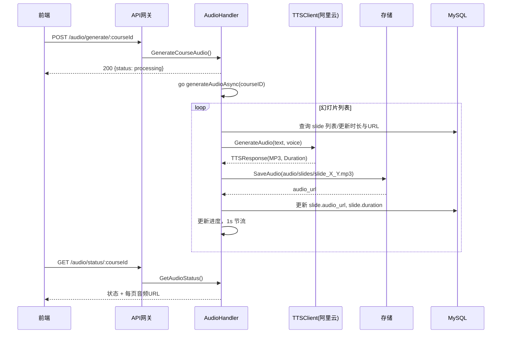

# 音频生成执行流程（AI课堂）

本文档梳理后端音频生成的端到端执行流程，涵盖 API 入口、异步任务、TTS 调用、文件保存、数据库更新、进度查询与预览等。适用于演示和排障定位。

## 总览
- 入口 API：/api/v1/audio/generate/:courseId（POST，鉴权）
- 任务模型：异步 goroutine 批量为课程的每张幻灯片生成音频
- TTS 引擎：阿里云 NLS（WebSocket）增强客户端，固定输出 MP3
- 存储：本地存储（storage.SaveAudio/UploadAudio）返回可访问 URL
- 进度查询：/api/v1/audio/status/:courseId（GET，鉴权）
- 语音预览：/api/v1/audio/preview（POST，鉴权）

## 请求路由与组装
- 路由注册：backend/internal/routes/audio_routes.go
  - 依赖注入：`ttsClient`（阿里云 TTS）、`LocalStorageService`、`db`、`repositories`
  - 路由：
    - POST `/api/v1/audio/generate/:courseId` → `AudioHandler.GenerateCourseAudio`
    - GET  `/api/v1/audio/status/:courseId` → `AudioHandler.GetAudioStatus`
    - POST `/api/v1/audio/preview` → `AudioHandler.PreviewVoice`

## 1) 生成课程音频（异步）
文件：backend/internal/handlers/audio_handler.go

1. 鉴权与课程权限校验
   - 从中间件获取 `user_id`，校验课程归属
2. 解析请求体（可默认）
   - `voice_type`、`speed`、`volume`、`regenerate`（是否重生成）
3. 并发保护与“正在生成”判定
   - 通过 `progressMap`（map[courseID]Progress + RWMutex）判断是否已有任务
4. 启动后台任务
   - `go h.generateAudioAsync(courseID, request)` 并立即返回 `{status: processing}`

### generateAudioAsync
- 初始化进度（`AudioGenerationProgress`）并写入 `progressMap`
- 查询课程所有幻灯片（按 `slide_number ASC`）
- 循环处理每张幻灯片：
  - 若已有 `audio_url` 且未要求 `regenerate` → 跳过并推进进度
  - 否则调用 `generateSlideAudio(ctx, slide, request)` 生成并保存
  - 更新进度（完成数、百分比、当前标题）
  - 频率限制：`time.Sleep(1 * time.Second)` 每秒 1 个请求（防止被限流）
- 结束：根据成功个数标记 `completed` 或 `partial_success`，记录操作日志

### generateSlideAudio（单张幻灯片）
- 文本组装：标题 + 内容 + 备注（`combineSlideContent`）
- 选择音色：从 `ttsClient.GetAvailableVoices()` 中匹配请求音色
- 生成音频：`ttsClient.GenerateAudio(text, voiceType)`
- 保存文件：
  - 生产环境固定为 MP3，文件名 `slide_{courseID}_{slideNumber}.mp3`
  - `storage.SaveAudio("audio/slides/...", audioData)` 返回可访问 URL
- 更新 DB：更新该 `slide` 的 `audio_url` 与 `duration`

## 2) 进度查询
接口：`GET /api/v1/audio/status/:courseId`
- 读取 `progressMap[courseID]` 若存在，返回 `processing + 进度详情`
- 若无任务，扫描 DB 幻灯片 `audio_url`：
  - 全部存在 → `completed`
  - 存在缺失 → `pending`
- 同时返回每张幻灯片的 `SlideAudioInfo`（id/title/url/duration/status）

## 3) 语音预览
接口：`POST /api/v1/audio/preview`
- 参数：`text`、`voice_type` 等
- 调用 `ttsClient.GenerateAudio` 生成临时音频
- `storage.UploadAudio("preview_*.mp3", data)` 返回临时 URL

## 4) TTS 客户端（阿里云 NLS 增强版）
文件：backend/pkg/tts/aliyun_tts_enhanced.go

- 方法：`GenerateAudioEnhanced(text, voiceType)`（对外暴露为 `GenerateAudio`）
- 关键过程：
  1) 获取 Token → 创建 WebSocket 连接（`nls.NewSpeechSynthesis`）
  2) 回调接收音频片段并写入 buffer
  3) 结束后拿到完整音频数据
  4) 格式处理：检测 WAV/MP3；若是 WAV 则转换为 MP3（兼容小程序）
  5) 时长估算并返回 `TTSResponse{AudioData, Duration, Format: mp3}`
- 重试与退避：当前实现为“线性退避”（第 n 次重试等待 `retryDelay * n`），可按需改为指数退避 + 抖动（推荐）

## 5) 通用 TTS 服务接口（服务层适配）
文件：backend/internal/services/tts_service.go
- 对外接口：`TTSService`
  - `GenerateSlideAudio(slide, voiceType)`：组装文本 → 调用 TTS 客户端 → `storage.SaveAudio` → 回写 DB 字段
  - `GenerateCourseAudio(course)`：批量为课程全部幻灯片生成（串行 100ms 间隔）
  - `GetAvailableVoices()`、`CalculateDuration()`

## 6) 与增强PPT服务的衔接
文件：backend/internal/services/enhanced_ppt_service.go
- 在 `GeneratePPT(req)` 中：当 `req.GenerateAudio == true` 时，会 `go s.generateAudioAsync(slides, req)`（占位，待实现）
- 现有“可用实现”是 `generateAudioForSlides()`：
  - 为每张增强幻灯片准备朗读文本（标题/内容/要点/备注）
  - 调用 `s.ttsService.GenerateSlideAudio(...)`（内部落库/保存 URL）
  - 汇总返回 `AudioFileInfo[]` 与总时长

## 7) 存储实现
文件：backend/pkg/storage/storage.go
- `SaveAudio(filepath, data)`：写本地 `./storage/...` 并返回 `file_base_url + /{filepath}`
- `UploadAudio(fileName, data)`：写 `./storage/audio/{unique}` 并返回 URL（用于预览或批量接口）

## 8) 错误处理与稳定性
- 任务层：
  - 进度状态：`processing/completed/partial_success/failed`
  - 失败信息写入 `progress.ErrorMessage` 与操作日志
- TTS 客户端层：
  - Token 获取失败/连接失败/回调错误 → 失败返回；线性退避重试若干次
- 节流：每张幻灯片至少 1 秒间隔；`GenerateCourseAudio` 串行 100ms；`EnhancedPPTService` 本身也做了 100ms 的轻节流

## 9) Mermaid 顺序图（课程音频生成主链路）

## 10) 常见排障位点
- 生成立即返回但状态不变：检查 goroutine 是否启动、是否被并发判定拦截
- TTS 返回为空或格式异常：查看增强客户端日志；WAV→MP3 转换路径
- URL 无法访问：确认 `server.file_base_url` 与本地存储路径 `./storage` 配置
- 生成速度慢：检查节流间隔（1s/100ms）、并发策略与限流情况

---

参考文件：
- handlers：`backend/internal/handlers/audio_handler.go`
- routes：`backend/internal/routes/audio_routes.go`
- tts service：`backend/internal/services/tts_service.go`
- enhanced ppt service：`backend/internal/services/enhanced_ppt_service.go`
- enhanced tts service：`backend/internal/services/enhanced_tts_service.go`
- tts client：`backend/pkg/tts/aliyun_tts_enhanced.go`
- storage：`backend/pkg/storage/storage.go`
