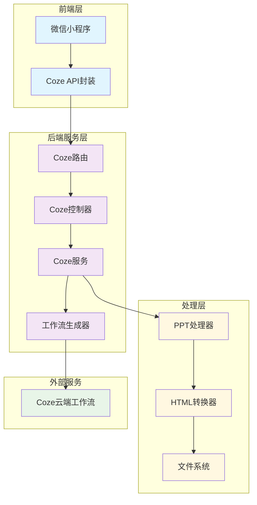
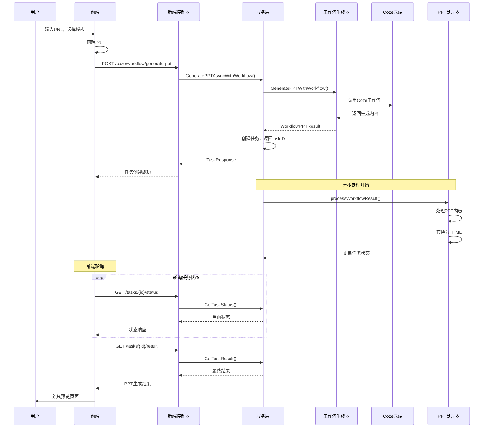

# Coze PPT生成功能技术文档

## 📋 目录

- [概述](#概述)
- [系统架构](#系统架构)
- [技术组件](#技术组件)
- [API接口](#api接口)
- [流程详解](#流程详解)
- [配置说明](#配置说明)
- [部署指南](#部署指南)
- [监控调试](#监控调试)
- [错误处理](#错误处理)
- [性能优化](#性能优化)
- [扩展开发](#扩展开发)

## 概述

Coze PPT生成功能是基于扣子(Coze)智能体平台的AI驱动PPT自动生成系统。该系统能够从URL内容自动提取信息，通过AI工作流生成结构化的PPT内容，并转换为可交互的HTML格式进行展示。

### 核心特性

- 🤖 **AI智能分析**：基于Coze工作流的内容理解和结构化
- 🚀 **异步处理**：支持大规模并发PPT生成任务
- 📱 **小程序适配**：专为微信小程序优化的交互体验
- 🎨 **多模板支持**：提供多种PPT模板和样式选择
- 📊 **实时监控**：完整的任务状态跟踪和进度反馈
- 🔧 **高可扩展**：模块化设计，支持多引擎接入

## 系统架构



### 架构层级

1. **前端表现层**：微信小程序界面和API封装
2. **API网关层**：路由分发和请求控制
3. **业务服务层**：核心业务逻辑和任务管理
4. **处理引擎层**：AI工作流执行和内容处理
5. **外部服务层**：Coze云端AI服务

## 技术组件

### 前端组件

#### 1. API封装层 (`frontend/apis/coze.js`)

```javascript
const cozeAPI = {
  // 一站式工作流生成
  createCourseWithWorkflow: async (data) => {
    // 提交工作流任务 -> 轮询状态 -> 返回结果
  },
  
  // 基础工作流调用
  generatePPTWithWorkflow: async (data) => {
    // 调用 POST /coze/workflow/generate-ppt
  },
  
  // 任务状态轮询
  pollTaskUntilComplete: async (taskId) => {
    // 智能轮询直到任务完成
  }
}
```

#### 2. 页面控制器 (`frontend/pages/course/create/create.js`)

```javascript
async generateCourseWithAI() {
  if (this.data.engineType === 'coze') {
    // Coze智能体生成流程
    const cozeParams = {
      url: this.data.urlInput,
      topic: this.data.formData.title,
      slides_count: this.data.formData.slide_count,
      template: this.data.formData.template,
      options: { language: 'zh-CN', style: 'professional' }
    }
    
    const result = await cozeAPI.createCourseWithWorkflow(cozeParams)
  }
}
```

### 后端组件

#### 1. 路由层 (`backend/internal/routes/coze_routes.go`)

```go
func SetupCozeRoutes(router *gin.Engine, cozeHandler *handlers.CozeHandler) {
  cozeGroup := router.Group("/api/v1/coze")
  {
    // 工作流PPT生成
    cozeGroup.POST("/workflow/generate-ppt", cozeHandler.GeneratePPTWithWorkflow)
    
    // 任务管理
    cozeGroup.GET("/tasks/:task_id/status", cozeHandler.GetTaskStatus)
    cozeGroup.GET("/tasks/:task_id/result", cozeHandler.GetTaskResult)
    cozeGroup.DELETE("/tasks/:task_id", cozeHandler.CleanupTask)
    
    // HTML预览
    cozeGroup.GET("/tasks/:task_id/html-preview", cozeHandler.GetTaskHTMLPreview)
  }
}
```

#### 2. 控制器层 (`backend/internal/handlers/coze_handler.go`)

```go
func (h *CozeHandler) GeneratePPTWithWorkflow(c *gin.Context) {
  var req services.GeneratePPTRequest
  if err := c.ShouldBindJSON(&req); err != nil {
    c.JSON(http.StatusBadRequest, gin.H{"error": err.Error()})
    return
  }

  // 调用工作流服务
  taskResp, err := h.cozeService.GeneratePPTAsyncWithWorkflow(c.Request.Context(), &req)
  if err != nil {
    c.JSON(http.StatusInternalServerError, gin.H{"error": err.Error()})
    return
  }

  c.JSON(http.StatusOK, gin.H{"data": taskResp})
}
```

#### 3. 服务层 (`backend/internal/services/coze_service.go`)

```go
func (s *CozeService) GeneratePPTAsyncWithWorkflow(ctx context.Context, req *GeneratePPTRequest) (*TaskResponse, error) {
  // 1. 参数验证
  if err := s.validateGenerateRequest(req); err != nil {
    return nil, err
  }

  // 2. 调用工作流生成器
  result, err := s.workflowGenerator.GeneratePPTWithWorkflow(ctx, req.URL, "service_user")
  if err != nil {
    return nil, err
  }

  // 3. 创建任务
  taskID := fmt.Sprintf("workflow_%s", result.ExecuteID)
  taskInfo := &TaskInfo{
    TaskID: taskID,
    Status: "processing",
    URL: req.URL,
  }

  // 4. 异步处理
  go s.processWorkflowResult(taskID, result)

  return &TaskResponse{TaskID: taskID}, nil
}
```

#### 4. 工作流生成器 (`backend/internal/coze/workflow_ppt_generator.go`)

```go
func (g *WorkflowPPTGenerator) GeneratePPTWithWorkflow(ctx context.Context, url, userID string) (*WorkflowPPTResult, error) {
  // 1. 准备工作流参数
  parameters := map[string]interface{}{
    "keyword": url,
  }

  // 2. 执行工作流
  runResp, err := g.client.RunWorkflow(ctx, parameters)
  if err != nil {
    return nil, err
  }

  // 3. 处理响应
  switch data := runResp.Data.(type) {
  case string:
    if strings.HasPrefix(data, "{") {
      // JSON格式结果
      return g.parseDirectResult(data)
    } else {
      // ExecuteID，需要轮询
      return g.pollWorkflowResult(ctx, data)
    }
  case map[string]interface{}:
    // 直接结果
    return g.parseDirectResult(data)
  }
}
```

#### 5. PPT处理器 (`backend/internal/coze/ppt_processor.go`)

```go
func (p *PPTProcessor) ProcessPPT(content string) (*PPTResult, error) {
  // 1. 解析PPT内容
  slides, err := p.parseSlides(content)
  if err != nil {
    return nil, err
  }

  // 2. 生成文件
  filename := p.generateFilename()
  
  // 3. 转换为HTML
  htmlPath, err := p.tmpConverter.ConvertToHTML(content, filename)
  if err != nil {
    return nil, err
  }

  return &PPTResult{
    Slides: slides,
    HTMLPath: htmlPath,
    Filename: filename,
  }, nil
}
```

## API接口

### 1. 工作流PPT生成

**接口地址**：`POST /api/v1/coze/workflow/generate-ppt`

**请求参数**：
```json
{
  "url": "https://example.com/article",
  "template": "professional",
  "options": {
    "language": "zh-CN",
    "style": "professional",
    "slides_count": 15
  }
}
```

**响应数据**：
```json
{
  "code": 200,
  "message": "工作流任务创建成功",
  "data": {
    "task_id": "workflow_abc123",
    "status": "processing",
    "estimated_time": 60,
    "created_at": "2024-01-01T10:00:00Z",
    "method": "workflow"
  }
}
```

### 2. 任务状态查询

**接口地址**：`GET /api/v1/coze/tasks/{task_id}/status`

**响应数据**：
```json
{
  "code": 200,
  "data": {
    "task_id": "workflow_abc123",
    "status": "completed",
    "progress": 100,
    "message": "PPT生成完成",
    "created_at": "2024-01-01T10:00:00Z",
    "updated_at": "2024-01-01T10:02:30Z"
  }
}
```

### 3. 任务结果获取

**接口地址**：`GET /api/v1/coze/tasks/{task_id}/result`

**响应数据**：
```json
{
  "code": 200,
  "data": {
    "task_id": "workflow_abc123",
    "status": "completed",
    "result": {
      "title": "生成的PPT标题",
      "slide_count": 15,
      "html_file": "/storage/ppt/abc123.html",
      "preview_url": "https://domain.com/preview/abc123.html",
      "download_url": "https://domain.com/download/abc123.html"
    }
  }
}
```

## 流程详解

### 完整生成流程



### 关键处理节点

#### 1. 参数验证阶段
```go
func (s *CozeService) validateGenerateRequest(req *GeneratePPTRequest) error {
  if req.URL == "" {
    return errors.New("URL不能为空")
  }
  
  if !isValidURL(req.URL) {
    return errors.New("URL格式无效")
  }
  
  if req.Template == "" {
    req.Template = "professional" // 默认模板
  }
  
  return nil
}
```

#### 2. 工作流执行阶段
```go
// 工作流参数准备
parameters := map[string]interface{}{
  "keyword": url, // 根据Coze工作流配置
}

// 执行工作流
runResp, err := g.client.RunWorkflow(ctx, parameters)
```

#### 3. 结果处理阶段
```go
// 异步处理工作流结果
func (s *CozeService) processWorkflowResult(taskID string, result *coze.WorkflowPPTResult) {
  defer func() {
    if r := recover(); r != nil {
      s.updateTaskStatus(taskID, "failed", 0, fmt.Sprintf("处理失败: %v", r))
    }
  }()

  // 转换PPT内容
  pptResult, err := s.processor.ProcessPPT(result.PPTContent)
  if err != nil {
    s.updateTaskStatus(taskID, "failed", 0, err.Error())
    return
  }

  // 更新任务状态为完成
  s.updateTaskStatus(taskID, "completed", 100, "PPT生成完成")
}
```

## 配置说明

### 1. Coze配置 (`backend/configs/config.yaml`)

```yaml
coze:
  api_key: "your_coze_api_key"
  base_url: "https://api.coze.cn"
  workflow_id: "7533813173200338996"
  timeout: 300
  retry_count: 3
  
  # 工作流配置
  workflow:
    ppt_generation:
      id: "7533813173200338996"
      parameters:
        keyword_field: "keyword"
      
  # 转换配置
  converter:
    template_type: "reveal"
    output_format: "html"
    enable_cache: true
    cache_timeout: 3600
    cdn_base_url: ""
```

### 2. 文件存储配置

```yaml
storage:
  ppt:
    base_path: "./storage/ppt"
    max_file_size: 50MB
    allowed_formats: ["html", "json", "tmp"]
    
server:
  file_base_url: "https://your-domain.com"
  external_host: "localhost"
  external_port: "9000"
```

### 3. 性能配置

```yaml
performance:
  max_concurrent_tasks: 10
  task_timeout: 600
  cleanup_interval: 3600
  max_task_history: 1000
```

## 部署指南

### 1. 环境要求

- Go 1.19+
- Node.js 16+
- 微信开发者工具
- Coze账号和API Key

### 2. 后端部署

```bash
# 1. 克隆代码
git clone <repository>
cd backend

# 2. 安装依赖
go mod download

# 3. 配置文件
cp configs/config.yaml.example configs/config.yaml
# 编辑配置文件，设置Coze API Key

# 4. 编译运行
go build -o main cmd/main.go
./main
```

### 3. 前端部署

```bash
# 1. 进入前端目录
cd frontend

# 2. 配置API地址
# 编辑 utils/config.js，设置后端API地址

# 3. 导入微信开发者工具
# 使用微信开发者工具打开frontend目录

# 4. 预览和发布
# 在开发者工具中预览和发布小程序
```

### 4. 生产环境配置

```nginx
# Nginx配置示例
server {
    listen 443 ssl;
    server_name your-domain.com;
    
    location /api/ {
        proxy_pass http://localhost:9000;
        proxy_set_header Host $host;
        proxy_set_header X-Real-IP $remote_addr;
        proxy_set_header X-Forwarded-For $proxy_add_x_forwarded_for;
        proxy_set_header X-Forwarded-Proto $scheme;
        
        # 长连接支持
        proxy_read_timeout 300;
        proxy_send_timeout 300;
    }
    
    location /storage/ {
        alias /path/to/storage/;
        expires 1d;
        add_header Cache-Control "public, immutable";
    }
}
```

## 监控调试

### 1. 日志监控

```go
// 关键日志记录点
log.Printf("工作流执行成功: ExecuteID=%s, Content长度=%d", 
    result.ExecuteID, len(result.PPTContent))

log.Printf("PPT处理完成: TaskID=%s, 文件路径=%s", 
    taskID, htmlPath)

log.Printf("任务状态更新: TaskID=%s, Status=%s, Progress=%d", 
    taskID, status, progress)
```

### 2. 性能监控

```go
// 任务执行时间统计
func (s *CozeService) monitorTaskExecution(taskID string, startTime time.Time) {
    duration := time.Since(startTime)
    
    // 记录到监控系统
    metrics.RecordTaskDuration(taskID, duration)
    
    // 慢任务告警
    if duration > 5*time.Minute {
        log.Printf("慢任务告警: TaskID=%s, Duration=%v", taskID, duration)
    }
}
```

### 3. 调试接口

```go
// 获取所有任务状态（调试用）
GET /api/v1/coze/tasks
Response:
{
  "code": 200,
  "data": {
    "total": 10,
    "processing": 2,
    "completed": 7,
    "failed": 1,
    "tasks": [...]
  }
}

// 任务详细信息
GET /api/v1/coze/tasks/{task_id}/debug
Response:
{
  "task_info": {...},
  "workflow_result": {...},
  "processing_log": [...],
  "error_details": {...}
}
```

## 错误处理

### 1. 常见错误类型

| 错误代码 | 错误类型 | 处理方式 |
|---------|---------|---------|
| 400 | 参数错误 | 前端验证，后端校验 |
| 401 | 认证失败 | 刷新Token，重新登录 |
| 403 | 权限不足 | 提示用户，升级权限 |
| 404 | 资源不存在 | 任务清理，重新创建 |
| 429 | 频率限制 | 延迟重试，队列控制 |
| 500 | 服务器错误 | 日志记录，告警通知 |
| 503 | 服务不可用 | 熔断机制，降级处理 |

### 2. 错误恢复机制

```go
// 任务失败重试
func (s *CozeService) retryFailedTask(taskID string, maxRetries int) error {
    for i := 0; i < maxRetries; i++ {
        if err := s.processTask(taskID); err == nil {
            return nil
        }
        
        // 指数退避
        time.Sleep(time.Duration(1<<i) * time.Second)
    }
    
    return errors.New("任务重试失败")
}

// 优雅降级
func (s *CozeService) fallbackProcessing(req *GeneratePPTRequest) (*TaskResponse, error) {
    // 如果Coze服务不可用，使用备用方案
    if !s.isCozeAvailable() {
        return s.fallbackGenerator.GeneratePPT(req)
    }
    
    return s.GeneratePPTAsyncWithWorkflow(context.Background(), req)
}
```

### 3. 错误通知

```go
// 错误告警
func (s *CozeService) alertError(taskID string, err error) {
    alert := &Alert{
        Level:   "error",
        Service: "coze-ppt-generation",
        TaskID:  taskID,
        Message: err.Error(),
        Time:    time.Now(),
    }
    
    // 发送到告警系统
    s.alertManager.Send(alert)
}
```

## 性能优化

### 1. 并发控制

```go
// 限制并发任务数
type TaskLimiter struct {
    semaphore chan struct{}
}

func NewTaskLimiter(maxConcurrent int) *TaskLimiter {
    return &TaskLimiter{
        semaphore: make(chan struct{}, maxConcurrent),
    }
}

func (t *TaskLimiter) Acquire() {
    t.semaphore <- struct{}{}
}

func (t *TaskLimiter) Release() {
    <-t.semaphore
}
```

### 2. 缓存策略

```go
// 结果缓存
type ResultCache struct {
    cache map[string]*CacheItem
    mutex sync.RWMutex
}

type CacheItem struct {
    Result    *PPTResult
    ExpiresAt time.Time
}

func (c *ResultCache) Get(key string) (*PPTResult, bool) {
    c.mutex.RLock()
    defer c.mutex.RUnlock()
    
    item, exists := c.cache[key]
    if !exists || time.Now().After(item.ExpiresAt) {
        return nil, false
    }
    
    return item.Result, true
}
```

### 3. 资源管理

```go
// 定期清理过期任务
func (s *CozeService) startTaskCleanup() {
    ticker := time.NewTicker(1 * time.Hour)
    go func() {
        for range ticker.C {
            s.cleanupExpiredTasks()
        }
    }()
}

func (s *CozeService) cleanupExpiredTasks() {
    s.taskMutex.Lock()
    defer s.taskMutex.Unlock()
    
    cutoff := time.Now().Add(-24 * time.Hour)
    for taskID, task := range s.tasks {
        if task.CreatedAt.Before(cutoff) {
            delete(s.tasks, taskID)
            s.cleanupTaskFiles(taskID)
        }
    }
}
```

## 扩展开发

### 1. 新增AI引擎

```go
// 引擎接口
type PPTGenerator interface {
    GeneratePPT(ctx context.Context, req *GeneratePPTRequest) (*TaskResponse, error)
    GetTaskStatus(ctx context.Context, taskID string) (*TaskStatus, error)
    GetTaskResult(ctx context.Context, taskID string) (*PPTResult, error)
}

// 实现新引擎
type CustomPPTGenerator struct {
    config *CustomConfig
}

func (g *CustomPPTGenerator) GeneratePPT(ctx context.Context, req *GeneratePPTRequest) (*TaskResponse, error) {
    // 实现自定义生成逻辑
}
```

### 2. 自定义模板

```go
// 模板配置
type TemplateConfig struct {
    ID          string `json:"id"`
    Name        string `json:"name"`
    Description string `json:"description"`
    Preview     string `json:"preview"`
    CSS         string `json:"css"`
    JS          string `json:"js"`
}

// 模板管理器
type TemplateManager struct {
    templates map[string]*TemplateConfig
}

func (m *TemplateManager) AddTemplate(template *TemplateConfig) {
    m.templates[template.ID] = template
}

func (m *TemplateManager) GetTemplate(id string) (*TemplateConfig, error) {
    template, exists := m.templates[id]
    if !exists {
        return nil, errors.New("模板不存在")
    }
    return template, nil
}
```

### 3. 插件系统

```go
// 插件接口
type Plugin interface {
    Name() string
    Version() string
    Initialize(config map[string]interface{}) error
    Process(ctx context.Context, data interface{}) (interface{}, error)
}

// 插件管理器
type PluginManager struct {
    plugins map[string]Plugin
}

func (m *PluginManager) RegisterPlugin(plugin Plugin) error {
    m.plugins[plugin.Name()] = plugin
    return plugin.Initialize(nil)
}

func (m *PluginManager) ExecutePlugin(name string, ctx context.Context, data interface{}) (interface{}, error) {
    plugin, exists := m.plugins[name]
    if !exists {
        return nil, errors.New("插件不存在")
    }
    
    return plugin.Process(ctx, data)
}
```

---

## 总结

Coze PPT生成功能是一个完整的AI驱动内容生成系统，具备以下特点：

- **高性能**：异步处理、并发控制、结果缓存
- **高可用**：错误重试、优雅降级、监控告警  
- **高扩展**：插件化架构、多引擎支持、模板系统
- **易维护**：详细日志、调试接口、文档完善

该系统可以作为AI内容生成的标准参考实现，支持后续功能扩展和性能优化。

---

**文档版本**：v1.0  
**更新时间**：2024-01-01  
**维护团队**：AI课堂开发团队