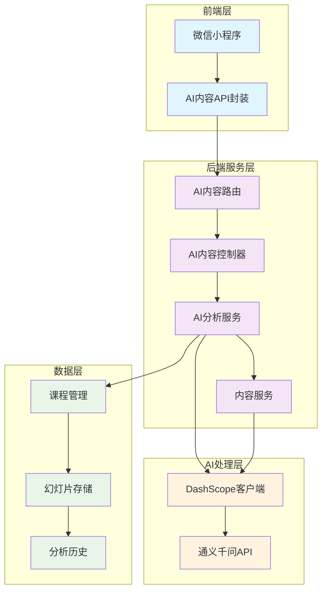
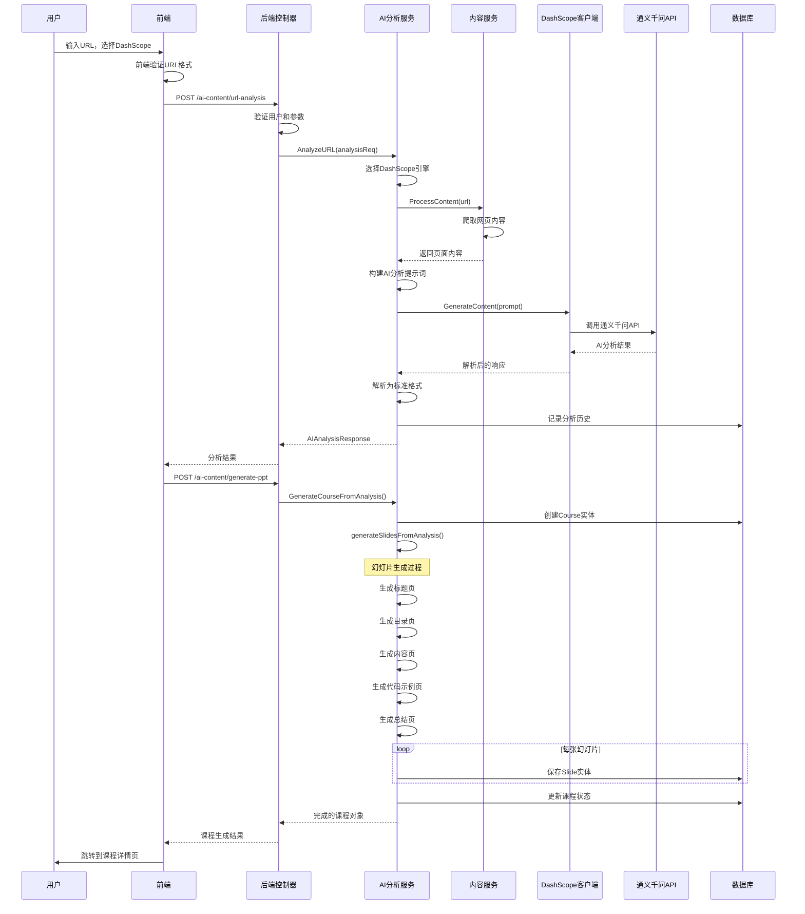

# DashScope AI智能体PPT生成功能技术文档

## 📋 目录

- [概述](#概述)
- [系统架构](#系统架构)
- [技术组件](#技术组件)
- [API接口文档](#api接口文档)
- [流程详解](#流程详解)
- [配置说明](#配置说明)
- [部署指南](#部署指南)
- [监控调试](#监控调试)
- [错误处理](#错误处理)
- [性能优化](#性能优化)
- [扩展开发](#扩展开发)

## 概述

DashScope AI智能体PPT生成功能是基于阿里云通义千问大模型的AI驱动内容分析和PPT自动生成系统。该系统通过先进的自然语言处理技术，能够智能分析URL内容，提取关键信息，并生成结构化的教学课件。

### 核心特性

- 🤖 **通义千问驱动**：基于阿里云DashScope平台的大语言模型
- 📝 **智能内容分析**：深度理解网页内容，提取核心知识点
- 🎨 **结构化生成**：自动组织PPT结构，生成教学友好的内容
- 📊 **多维度解析**：支持技术文档、教程、论文等多种内容类型
- 🔧 **灵活配置**：支持多种分析类型和生成参数
- 💾 **数据持久化**：完整的数据库存储和历史记录

## 系统架构



### 架构特点

1. **分层设计**：清晰的前后端分离和服务分层
2. **AI驱动**：深度集成阿里云通义千问大模型
3. **模块化**：高度解耦的组件设计
4. **可扩展**：支持多AI引擎的架构设计
5. **数据完整性**：完整的数据存储和历史追踪

## 技术组件

### 前端组件

#### 1. AI内容API封装 (`frontend/apis/ai-content.js`)

```javascript
const aiContentAPI = {
  // AI URL分析
  analyzeURL: (data) => {
    return request({
      url: '/ai-content/url-analysis',
      method: 'POST',
      data: {
        url: data.url,
        analysis_type: data.analysis_type || 'comprehensive',
        engine_type: data.engine_type || 'dashscope',
        language: data.language || 'zh-CN'
      },
      needAuth: true,
      timeout: 120000 // 2分钟超时
    })
  },

  // 基于AI分析生成PPT
  generatePPT: (data) => {
    return request({
      url: '/ai-content/generate-ppt',
      method: 'POST',
      data: {
        ai_content: data.ai_content,
        generation_params: data.generation_params
      },
      needAuth: true,
      timeout: 300000 // 5分钟超时
    })
  }
}
```

#### 2. 引擎选择界面 (`frontend/pages/course/create/create.wxml`)

```xml
<!-- AI引擎选择 -->
<view class="engine-selection" wx:if="{{generationMode === 'ai_enhanced'}}">
  <view class="engine-options">
    <view class="engine-option {{engineType === 'dashscope' ? 'active' : ''}}"
          bindtap="switchEngine" data-engine="dashscope">
      <view class="engine-info">
        <text class="engine-name">DashScope</text>
        <text class="engine-desc">通义千问大模型</text>
      </view>
      <view class="engine-status online">
        <text class="status-dot"></text>
        <text class="status-text">可用</text>
      </view>
    </view>
  </view>
</view>
```

#### 3. 生成流程控制 (`frontend/pages/course/create/create.js`)

```javascript
async generateCourseWithAI() {
  if (this.data.engineType === 'dashscope') {
    // 第一步：AI分析URL内容
    this.smoothUpdateProgress(25, '正在深度分析内容结构...')
    
    const analysisParams = {
      url: this.data.urlInput,
      analysis_type: 'comprehensive',
      engine_type: 'dashscope',
      language: 'zh-CN'
    }

    const analysisResult = await aiContentAPI.analyzeURL(analysisParams)
    
    // 第二步：基于分析结果生成PPT
    this.smoothUpdateProgress(70, '正在生成高质量PPT内容...')
    
    const pptParams = {
      ai_content: analysisResult,
      generation_params: {
        slide_count: this.data.formData.slide_count,
        style: 'professional',
        include_code_examples: true,
        include_best_practices: true,
        template: this.data.formData.template,
        language: 'zh-CN'
      }
    }

    const pptResult = await aiContentAPI.generatePPT(pptParams)
    
    // 跳转到课程详情页
    wx.navigateTo({
      url: `/pages/course/detail/detail?id=${pptResult.course_id}`
    })
  }
}
```

### 后端组件

#### 1. AI内容控制器 (`backend/internal/handlers/ai_content_handler.go`)

```go
type AIContentHandler struct {
    aiAnalysisService *services.AIContentAnalysisService
    db                *gorm.DB
}

// AI URL分析接口
func (h *AIContentHandler) AIURLAnalysis(c *gin.Context) {
    var req AIURLAnalysisRequest
    if err := c.ShouldBindJSON(&req); err != nil {
        utils.ErrorResponse(c, http.StatusBadRequest, "请求参数错误", err.Error())
        return
    }

    // 获取用户ID
    userID := middleware.GetCurrentUserID(c)
    if userID == 0 {
        utils.ErrorResponse(c, http.StatusUnauthorized, "用户未认证")
        return
    }

    // 构建分析请求
    analysisReq := &services.AnalysisRequest{
        URL:          req.URL,
        AnalysisType: req.AnalysisType,
        EngineType:   services.AIEngineType(req.EngineType),
        Language:     req.Language,
    }

    // 调用AI分析服务
    ctx, cancel := context.WithTimeout(context.Background(), 60*time.Second)
    defer cancel()

    result, err := h.aiAnalysisService.AnalyzeURL(ctx, analysisReq)
    if err != nil {
        utils.ErrorResponse(c, http.StatusInternalServerError, "AI分析失败", err.Error())
        return
    }

    utils.SuccessResponse(c, "AI分析完成", result)
}

// AI生成PPT接口
func (h *AIContentHandler) AIGeneratePPT(c *gin.Context) {
    var req AIGeneratePPTRequest
    if err := c.ShouldBindJSON(&req); err != nil {
        utils.ErrorResponse(c, http.StatusBadRequest, "请求参数错误", err.Error())
        return
    }

    userID := middleware.GetCurrentUserID(c)
    if userID == 0 {
        utils.ErrorResponse(c, http.StatusUnauthorized, "用户未认证")
        return
    }

    // 生成课程
    course, err := h.aiAnalysisService.GenerateCourseFromAnalysis(
        userID,
        req.AIContent,
        req.GenerationParams,
    )
    if err != nil {
        utils.ErrorResponse(c, http.StatusInternalServerError, "生成课程失败", err.Error())
        return
    }

    utils.SuccessResponse(c, "课程生成成功", course)
}
```

#### 2. AI分析服务 (`backend/internal/services/ai_content_analysis_service.go`)

```go
type AIContentAnalysisService struct {
    dashScopeClient *ai.DashScopeClient
    db              *gorm.DB
    contentService  *ContentService
}

// URL分析主入口
func (s *AIContentAnalysisService) AnalyzeURL(ctx context.Context, req *AnalysisRequest) (*models.AIAnalysisResponse, error) {
    startTime := time.Now()

    // 根据引擎类型调用不同的分析方法
    switch req.EngineType {
    case EngineDashScope:
        result, err := s.analyzeWithDashScope(ctx, req)
        if err != nil {
            return nil, err
        }
        
        // 设置元数据
        result.Metadata = &models.AnalysisMetadata{
            AnalysisTime: startTime,
            EngineUsed:   string(req.EngineType),
        }
        result.URL = req.URL

        // 记录分析历史
        go s.recordAnalysisHistory(req, result, time.Since(startTime), "completed", "")

        return result, nil
    }
}

// DashScope分析实现
func (s *AIContentAnalysisService) analyzeWithDashScope(ctx context.Context, req *AnalysisRequest) (*models.AIAnalysisResponse, error) {
    // 1. 爬取URL内容
    contentReq := &ContentRequest{
        Type: "url",
        URL:  req.URL,
    }

    contentResult, err := s.contentService.ProcessContent(contentReq)
    if err != nil {
        // 如果爬取失败，仍然可以基于URL进行基础分析
        content = fmt.Sprintf("URL: %s\n注意：由于网络或权限问题，无法直接获取页面内容", req.URL)
    } else {
        content = fmt.Sprintf("标题: %s\n内容: %s", contentResult.Title, contentResult.Content)
        
        // 限制内容长度避免token超限
        if len(content) > 8000 {
            content = content[:8000] + "...\n[内容过长已截断]"
        }
    }

    // 2. 构建分析提示词
    prompt := s.buildDashScopePromptWithContent(req.URL, content, req.AnalysisType, req.Language)

    // 3. 调用DashScope API
    response, err := s.dashScopeClient.GenerateContent(prompt)
    if err != nil {
        return s.generateFallbackResponse(req.URL), nil
    }

    // 4. 解析AI响应
    result, err := s.parseDashScopeResponse(response, req.URL)
    if err != nil {
        return s.generateFallbackResponse(req.URL), nil
    }

    return result, nil
}
```

#### 3. DashScope客户端 (`backend/pkg/ai/dashscope.go`)

```go
type DashScopeClient struct {
    apiKey  string
    baseURL string
    client  *http.Client
}

// 生成内容
func (c *DashScopeClient) GenerateContent(prompt string) (string, error) {
    messages := []Message{
        {
            Role:    "system",
            Content: "你是一个专业的教育内容生成助手，擅长将各种内容转换为结构化的PPT课件。请严格按照要求的JSON格式输出。",
        },
        {
            Role:    "user",
            Content: prompt,
        },
    }

    response, err := c.ChatCompletion(messages)
    if err != nil {
        return "", err
    }

    return response.Output.Text, nil
}

// 分析内容
func (c *DashScopeClient) AnalyzeContent(content string) (string, error) {
    prompt := fmt.Sprintf(`请分析以下内容，提取关键信息：

内容：
%s

请分析并输出JSON格式：
{
    "topic": "内容主题",
    "field": "所属领域（技术/商业/教育/科学等）",
    "difficulty": "难度等级（入门/进阶/高级）",
    "key_points": ["关键点1", "关键点2", "关键点3"],
    "suggested_slides": 建议幻灯片数量,
    "target_audience": "目标受众",
    "learning_objectives": ["学习目标1", "学习目标2"]
}`, content)

    return c.GenerateContent(prompt)
}

// 发送请求到通义千问API
func (c *DashScopeClient) sendRequest(request ChatRequest) (*ChatResponse, error) {
    requestBody, err := json.Marshal(request)
    if err != nil {
        return nil, fmt.Errorf("序列化请求失败: %v", err)
    }

    req, err := http.NewRequest("POST", c.baseURL+"/services/aigc/text-generation/generation", bytes.NewBuffer(requestBody))
    if err != nil {
        return nil, fmt.Errorf("创建请求失败: %v", err)
    }

    // 设置请求头
    req.Header.Set("Content-Type", "application/json")
    req.Header.Set("Authorization", "Bearer "+c.apiKey)
    req.Header.Set("X-DashScope-SSE", "disable")

    resp, err := c.client.Do(req)
    if err != nil {
        return nil, fmt.Errorf("发送请求失败: %v", err)
    }
    defer resp.Body.Close()

    body, err := io.ReadAll(resp.Body)
    if err != nil {
        return nil, fmt.Errorf("读取响应失败: %v", err)
    }

    if resp.StatusCode != http.StatusOK {
        return nil, fmt.Errorf("HTTP错误 %d: %s", resp.StatusCode, string(body))
    }

    var response ChatResponse
    if err := json.Unmarshal(body, &response); err != nil {
        return nil, fmt.Errorf("解析响应失败: %v", err)
    }

    return &response, nil
}
```

## API接口文档

### 1. AI URL分析

**接口地址**：`POST /api/v1/ai-content/url-analysis`

**请求参数**：
```json
{
  "url": "https://developers.weixin.qq.com/miniprogram/dev/",
  "analysis_type": "comprehensive",
  "engine_type": "dashscope",
  "language": "zh-CN"
}
```

**参数说明**：
- `url` (string, required): 要分析的URL地址
- `analysis_type` (string, optional): 分析类型，可选值：
  - `comprehensive`: 综合分析（默认）
  - `summary`: 摘要分析
  - `technical`: 技术分析
- `engine_type` (string, optional): AI引擎类型，默认 `dashscope`
- `language` (string, optional): 输出语言，默认 `zh-CN`

**响应数据**：
```json
{
  "code": 200,
  "message": "AI分析完成",
  "data": {
    "url": "https://developers.weixin.qq.com/miniprogram/dev/",
    "title": "微信小程序开发文档",
    "summary": "详细的内容摘要...",
    "key_points": ["关键点1", "关键点2", "关键点3"],
    "technical_concepts": [
      {
        "name": "小程序框架",
        "description": "微信小程序的基础框架结构",
        "category": "框架技术",
        "importance": 9
      }
    ],
    "structured_content": {
      "introduction": "微信小程序开发介绍",
      "main_sections": [
        {
          "title": "快速开始",
          "content": "开发环境配置和第一个小程序",
          "sub_sections": ["环境准备", "创建项目"],
          "key_points": ["开发者工具", "项目结构"]
        }
      ],
      "conclusion": "小程序开发总结",
      "examples": [
        {
          "title": "Hello World示例",
          "code": "Page({ data: { message: 'Hello World' } })",
          "language": "javascript",
          "description": "最简单的页面示例"
        }
      ],
      "best_practices": ["代码规范", "性能优化"]
    },
    "metadata": {
      "content_type": "技术文档",
      "difficulty_level": "中级",
      "estimated_time": 45,
      "tags": ["微信小程序", "前端开发", "移动应用"]
    }
  }
}
```

### 2. 基于AI分析生成PPT

**接口地址**：`POST /api/v1/ai-content/generate-ppt`

**请求参数**：
```json
{
  "ai_content": {
    // AI分析结果对象（从第一步获取）
  },
  "generation_params": {
    "slide_count": 15,
    "style": "professional",
    "include_code_examples": true,
    "include_best_practices": true,
    "template": "technical",
    "language": "zh-CN"
  }
}
```

**参数说明**：
- `ai_content` (object, required): AI分析结果对象
- `generation_params` (object, optional): PPT生成参数
  - `slide_count` (number): 幻灯片数量，默认15
  - `style` (string): 样式，可选 `professional`, `casual`, `academic`
  - `include_code_examples` (boolean): 是否包含代码示例，默认true
  - `include_best_practices` (boolean): 是否包含最佳实践，默认true
  - `template` (string): 模板类型，可选 `technical`, `business`, `education`
  - `language` (string): 语言，默认 `zh-CN`

**响应数据**：
```json
{
  "code": 200,
  "message": "课程生成成功",
  "data": {
    "id": 123,
    "title": "微信小程序开发文档",
    "description": "基于AI智能分析生成的小程序开发课程",
    "slides_count": 15,
    "status": "completed",
    "source_type": "ai_analysis",
    "source_url": "https://developers.weixin.qq.com/miniprogram/dev/",
    "created_at": "2024-01-01T10:00:00Z",
    "updated_at": "2024-01-01T10:02:30Z"
  }
}
```

### 3. 获取分析历史

**接口地址**：`GET /api/v1/ai-content/analysis-history`

**查询参数**：
- `page` (number, optional): 页码，默认1
- `page_size` (number, optional): 每页数量，默认10
- `engine_type` (string, optional): 引擎类型过滤

**响应数据**：
```json
{
  "code": 200,
  "data": {
    "total": 50,
    "page": 1,
    "page_size": 10,
    "items": [
      {
        "id": 1,
        "url": "https://example.com",
        "title": "分析标题",
        "engine_type": "dashscope",
        "analysis_type": "comprehensive",
        "status": "completed",
        "created_at": "2024-01-01T10:00:00Z"
      }
    ]
  }
}
```

## 流程详解

### 完整生成流程



### 关键处理节点

#### 1. URL内容分析阶段

```go
// 内容爬取和预处理
func (s *AIContentAnalysisService) analyzeWithDashScope(ctx context.Context, req *AnalysisRequest) (*models.AIAnalysisResponse, error) {
    // 1. 爬取URL内容
    contentReq := &ContentRequest{
        Type: "url",
        URL:  req.URL,
    }

    contentResult, err := s.contentService.ProcessContent(contentReq)
    
    // 2. 内容预处理
    var content string
    if err != nil {
        // 爬取失败的回退策略
        content = fmt.Sprintf("URL: %s\n注意：无法获取页面内容，基于URL进行分析", req.URL)
    } else {
        content = fmt.Sprintf("标题: %s\n内容: %s", contentResult.Title, contentResult.Content)
        
        // 内容长度限制
        if len(content) > 8000 {
            content = content[:8000] + "...\n[内容过长已截断]"
        }
    }

    return content, nil
}
```

#### 2. AI提示词构建

```go
func (s *AIContentAnalysisService) buildDashScopePromptWithContent(url, content, analysisType, language string) string {
    basePrompt := fmt.Sprintf(`
请分析以下URL的内容并生成详细的技术总结：

URL: %s

内容：
%s

分析类型：%s
输出语言：%s

请严格按照以下JSON格式输出：
{
    "url": "%s",
    "title": "内容标题",
    "summary": "详细内容摘要（至少100字）",
    "key_points": ["关键点1", "关键点2", "关键点3"],
    "technical_concepts": [
        {
            "name": "概念名称",
            "description": "概念描述", 
            "category": "概念分类",
            "importance": 8
        }
    ],
    "structured_content": {
        "introduction": "内容介绍",
        "main_sections": [...],
        "conclusion": "总结",
        "examples": [...],
        "best_practices": [...]
    },
    "metadata": {
        "content_type": "内容类型",
        "difficulty_level": "难度等级",
        "estimated_time": 30,
        "tags": ["标签1", "标签2"]
    }
}`, url, content, analysisType, language, url)

    // 根据URL类型添加特定提示
    if strings.Contains(url, "developers.weixin.qq.com") {
        basePrompt += `
特别说明：这是微信小程序开发者文档，请重点关注：
- 小程序开发相关的API和功能
- 具体的代码示例和使用方法
- 开发过程中的注意事项
- 最佳实践和常见问题`
    }

    return basePrompt
}
```

#### 3. 幻灯片生成算法

```go
func (s *AIContentAnalysisService) generateSlidesFromAnalysis(
    analysis *models.AIAnalysisResponse,
    params *PPTGenerationParams,
) ([]AISlideContent, error) {
    var slides []AISlideContent

    // 1. 标题页
    titleSlide := AISlideContent{
        Title:   analysis.Title,
        Content: fmt.Sprintf("基于：%s\n\n%s", analysis.URL, analysis.Summary),
        Type:    "title",
        Metadata: map[string]interface{}{
            "source_url":   analysis.URL,
            "generated_at": time.Now(),
        },
    }
    slides = append(slides, titleSlide)

    // 2. 目录页
    if analysis.StructuredContent != nil && len(analysis.StructuredContent.MainSections) > 0 {
        var tocItems []string
        for i, section := range analysis.StructuredContent.MainSections {
            tocItems = append(tocItems, fmt.Sprintf("%d. %s", i+1, section.Title))
        }

        tocSlide := AISlideContent{
            Title:   "课程目录",
            Content: strings.Join(tocItems, "\n"),
            Type:    "content",
        }
        slides = append(slides, tocSlide)
    }

    // 3. 关键概念页
    if len(analysis.TechnicalConcepts) > 0 {
        conceptsSlide := s.generateConceptsSlide(analysis.TechnicalConcepts)
        slides = append(slides, conceptsSlide)
    }

    // 4. 内容章节页
    if analysis.StructuredContent != nil {
        for _, section := range analysis.StructuredContent.MainSections {
            sectionSlide := s.generateSectionSlide(section)
            slides = append(slides, sectionSlide)
        }
    }

    // 5. 代码示例页
    if params.IncludeCodeExamples && analysis.StructuredContent != nil {
        for _, example := range analysis.StructuredContent.Examples {
            exampleSlide := s.generateCodeExampleSlide(example)
            slides = append(slides, exampleSlide)
        }
    }

    // 6. 最佳实践页
    if params.IncludeBestPractices && analysis.StructuredContent != nil {
        practicesSlide := s.generateBestPracticesSlide(analysis.StructuredContent.BestPractices)
        slides = append(slides, practicesSlide)
    }

    // 7. 总结页
    summarySlide := AISlideContent{
        Title:   "课程总结",
        Content: fmt.Sprintf("%s\n\n关键要点：\n%s", 
            analysis.StructuredContent.Conclusion,
            strings.Join(analysis.KeyPoints, "\n• ")),
        Type:    "summary",
    }
    slides = append(slides, summarySlide)

    return slides, nil
}
```

## 配置说明

### 1. DashScope配置 (`backend/configs/config.yaml`)

```yaml
dashscope:
  api_key: "your_dashscope_api_key"
  base_url: "https://dashscope.aliyuncs.com/api/v1"
  model: "qwen-turbo"
  timeout: 60
  retry_count: 3
  max_tokens: 4000
  temperature: 0.7
  top_p: 0.9
  
  # 内容限制
  content:
    max_length: 8000
    truncate_suffix: "...\n[内容过长已截断]"
    
  # 分析参数
  analysis:
    default_type: "comprehensive"
    default_language: "zh-CN"
    
  # 回退配置
  fallback:
    enabled: true
    mock_response: true
```

### 2. AI内容服务配置

```yaml
ai_content:
  # 引擎配置
  engines:
    dashscope:
      enabled: true
      priority: 1
      timeout: 60
    coze:
      enabled: false
      priority: 2
      timeout: 120
      
  # 分析历史
  history:
    max_records: 1000
    cleanup_days: 30
    
  # PPT生成
  ppt_generation:
    default_slide_count: 15
    max_slide_count: 50
    default_style: "professional"
    supported_templates: ["technical", "business", "education"]
```

### 3. 内容爬取配置

```yaml
content_service:
  crawler:
    timeout: 30
    max_retries: 3
    user_agent: "AI-Classroom-Bot/1.0"
    respect_robots_txt: true
    
  # 内容过滤
  content_filter:
    min_content_length: 100
    max_content_length: 50000
    remove_scripts: true
    remove_styles: true
    extract_text_only: true
```

## 部署指南

### 1. 环境要求

- Go 1.19+
- MySQL 8.0+
- Redis (可选，用于缓存)
- DashScope API Key (阿里云)

### 2. 后端部署

```bash
# 1. 克隆代码
git clone <repository>
cd backend

# 2. 安装依赖
go mod download

# 3. 配置文件
cp configs/config.yaml.example configs/config.yaml

# 编辑配置文件，设置DashScope API Key
vim configs/config.yaml

# 4. 数据库迁移
go run cmd/migrate/main.go

# 5. 编译运行
go build -o main cmd/main.go
./main
```

### 3. DashScope API Key配置

```yaml
# configs/config.yaml
dashscope:
  api_key: "sk-xxxxxxxxxxxxxxxxxx"  # 替换为实际的API Key
  base_url: "https://dashscope.aliyuncs.com/api/v1"
  model: "qwen-turbo"
```

获取API Key步骤：
1. 访问[阿里云DashScope控制台](https://dashscope.console.aliyun.com/)
2. 创建应用并获取API Key
3. 配置API调用权限和配额

### 4. 前端配置

```javascript
// frontend/utils/config.js
const config = {
  apiBaseUrl: 'https://your-domain.com/api/v1',
  timeout: 300000, // 5分钟超时适应AI分析
  
  // AI引擎配置
  aiEngines: {
    dashscope: {
      name: 'DashScope',
      description: '通义千问大模型',
      enabled: true
    }
  }
}
```

## 监控调试

### 1. 日志监控

```go
// 关键日志记录点
log.Printf("🔍 [AI分析] 开始分析URL: %s", req.URL)
log.Printf("🔍 [AI分析] 分析类型: %s, 引擎类型: %s", req.AnalysisType, req.EngineType)
log.Printf("🤖 调用DashScope API进行内容分析")
log.Printf("✅ 成功爬取内容，长度: %d 字符", len(content))
log.Printf("✅ [AI分析] 分析成功，结果标题: %s", result.Title)
log.Printf("🔍 [AI分析] 分析耗时: %v", time.Since(startTime))
log.Printf("🔍 [PPT生成] 开始从AI分析结果生成幻灯片")
log.Printf("✅ [PPT生成] 幻灯片生成成功，共生成 %d 张幻灯片", len(slides))
```

### 2. 性能监控

```go
// 分析耗时统计
func (s *AIContentAnalysisService) monitorAnalysisPerformance(req *AnalysisRequest, startTime time.Time) {
    duration := time.Since(startTime)
    
    // 记录到监控系统
    metrics.RecordAnalysisDuration(string(req.EngineType), duration)
    
    // 慢查询告警
    if duration > 2*time.Minute {
        log.Printf("慢分析告警: URL=%s, Engine=%s, Duration=%v", 
            req.URL, req.EngineType, duration)
    }
}

// API调用统计
func (c *DashScopeClient) recordAPICall(success bool, duration time.Duration) {
    metrics.IncrementAPICall("dashscope", success)
    metrics.RecordAPILatency("dashscope", duration)
}
```

### 3. 错误监控

```go
// 错误分类统计
func (s *AIContentAnalysisService) recordError(errorType string, err error, context map[string]interface{}) {
    errorLog := &models.ErrorLog{
        Type:      errorType,
        Message:   err.Error(),
        Context:   context,
        Timestamp: time.Now(),
    }
    
    // 保存到数据库
    s.db.Create(errorLog)
    
    // 发送告警
    if errorType == "api_failure" || errorType == "quota_exceeded" {
        s.alertManager.SendAlert("DashScope分析错误", err.Error(), context)
    }
}
```

## 错误处理

### 1. 常见错误类型

| 错误代码 | 错误类型 | 原因 | 处理方式 |
|---------|---------|------|---------|
| 400 | 参数错误 | URL格式无效 | 前端验证，后端校验 |
| 401 | 认证失败 | API Key无效 | 检查配置，刷新密钥 |
| 403 | 权限不足 | API配额不足 | 升级套餐，限流控制 |
| 429 | 频率限制 | 请求过于频繁 | 指数退避重试 |
| 500 | API错误 | DashScope服务异常 | 回退方案，告警通知 |
| 504 | 超时错误 | 分析时间过长 | 增加超时，内容截断 |

### 2. 错误恢复策略

```go
// API调用重试机制
func (c *DashScopeClient) generateContentWithRetry(prompt string, maxRetries int) (string, error) {
    var lastErr error
    
    for i := 0; i < maxRetries; i++ {
        result, err := c.GenerateContent(prompt)
        if err == nil {
            return result, nil
        }
        
        lastErr = err
        
        // 检查是否为可重试错误
        if !c.isRetryableError(err) {
            break
        }
        
        // 指数退避
        waitTime := time.Duration(1<<i) * time.Second
        time.Sleep(waitTime)
        
        log.Printf("DashScope API重试 %d/%d，等待 %v", i+1, maxRetries, waitTime)
    }
    
    return "", lastErr
}

// 回退响应生成
func (s *AIContentAnalysisService) generateFallbackResponse(url string) *models.AIAnalysisResponse {
    return &models.AIAnalysisResponse{
        URL:     url,
        Title:   "内容分析",
        Summary: "由于网络或服务原因，无法完成详细分析，但已基于URL结构生成基础内容。",
        KeyPoints: []string{
            "基于URL结构的基础分析",
            "建议检查网络连接和服务状态",
            "可尝试重新分析获取详细内容",
        },
        Metadata: &models.AnalysisMetadata{
            ContentType:    "未知",
            DifficultyLevel: "中级",
            EstimatedTime:  15,
            Tags:          []string{"回退分析"},
        },
    }
}
```

### 3. 配额管理

```go
// API配额监控
type QuotaManager struct {
    dailyLimit   int
    usedToday    int
    resetTime    time.Time
    mutex        sync.RWMutex
}

func (q *QuotaManager) CheckQuota() error {
    q.mutex.RLock()
    defer q.mutex.RUnlock()
    
    // 检查是否需要重置
    if time.Now().After(q.resetTime) {
        q.usedToday = 0
        q.resetTime = time.Now().Add(24 * time.Hour)
    }
    
    if q.usedToday >= q.dailyLimit {
        return errors.New("API配额已用完，请明天再试")
    }
    
    return nil
}

func (q *QuotaManager) ConsumeQuota() {
    q.mutex.Lock()
    defer q.mutex.Unlock()
    q.usedToday++
}
```

## 性能优化

### 1. 内容缓存策略

```go
// 分析结果缓存
type AnalysisCache struct {
    cache map[string]*CacheItem
    mutex sync.RWMutex
    ttl   time.Duration
}

type CacheItem struct {
    Result    *models.AIAnalysisResponse
    ExpiresAt time.Time
}

func (c *AnalysisCache) Get(key string) (*models.AIAnalysisResponse, bool) {
    c.mutex.RLock()
    defer c.mutex.RUnlock()
    
    item, exists := c.cache[key]
    if !exists || time.Now().After(item.ExpiresAt) {
        return nil, false
    }
    
    return item.Result, true
}

func (c *AnalysisCache) Set(key string, result *models.AIAnalysisResponse) {
    c.mutex.Lock()
    defer c.mutex.Unlock()
    
    c.cache[key] = &CacheItem{
        Result:    result,
        ExpiresAt: time.Now().Add(c.ttl),
    }
}

// 使用缓存的分析方法
func (s *AIContentAnalysisService) AnalyzeURLWithCache(ctx context.Context, req *AnalysisRequest) (*models.AIAnalysisResponse, error) {
    // 生成缓存键
    cacheKey := fmt.Sprintf("%s:%s:%s:%s", req.URL, req.AnalysisType, req.EngineType, req.Language)
    
    // 检查缓存
    if cached, exists := s.cache.Get(cacheKey); exists {
        log.Printf("🎯 使用缓存的分析结果: %s", req.URL)
        return cached, nil
    }
    
    // 执行分析
    result, err := s.AnalyzeURL(ctx, req)
    if err != nil {
        return nil, err
    }
    
    // 存储到缓存
    s.cache.Set(cacheKey, result)
    
    return result, nil
}
```

### 2. 并发控制

```go
// 并发限制器
type ConcurrencyLimiter struct {
    semaphore chan struct{}
}

func NewConcurrencyLimiter(maxConcurrent int) *ConcurrencyLimiter {
    return &ConcurrencyLimiter{
        semaphore: make(chan struct{}, maxConcurrent),
    }
}

func (c *ConcurrencyLimiter) Acquire() {
    c.semaphore <- struct{}{}
}

func (c *ConcurrencyLimiter) Release() {
    <-c.semaphore
}

// 使用并发限制的分析
func (s *AIContentAnalysisService) AnalyzeURLConcurrent(ctx context.Context, req *AnalysisRequest) (*models.AIAnalysisResponse, error) {
    // 获取并发许可
    s.concurrencyLimiter.Acquire()
    defer s.concurrencyLimiter.Release()
    
    return s.AnalyzeURL(ctx, req)
}
```

### 3. 内容预处理优化

```go
// 智能内容截断
func (s *AIContentAnalysisService) optimizeContent(content string, maxLength int) string {
    if len(content) <= maxLength {
        return content
    }
    
    // 按句子截断，保持语义完整性
    sentences := strings.Split(content, "。")
    var result strings.Builder
    
    for _, sentence := range sentences {
        if result.Len()+len(sentence)+1 > maxLength {
            break
        }
        result.WriteString(sentence)
        result.WriteString("。")
    }
    
    // 如果截断后内容太短，使用字符截断
    if result.Len() < maxLength/2 {
        return content[:maxLength] + "..."
    }
    
    return result.String() + "\n[智能截断]"
}

// 并行内容处理
func (s *AIContentAnalysisService) processContentParallel(url string) (*ProcessedContent, error) {
    var wg sync.WaitGroup
    var content string
    var title string
    var err error
    
    // 并行爬取内容和提取标题
    wg.Add(2)
    
    go func() {
        defer wg.Done()
        content, err = s.crawler.ExtractContent(url)
    }()
    
    go func() {
        defer wg.Done()
        title, _ = s.crawler.ExtractTitle(url)
    }()
    
    wg.Wait()
    
    if err != nil {
        return nil, err
    }
    
    return &ProcessedContent{
        Title:   title,
        Content: s.optimizeContent(content, 8000),
    }, nil
}
```

## 扩展开发

### 1. 新增AI引擎支持

```go
// AI引擎接口
type AIEngine interface {
    GenerateContent(prompt string) (string, error)
    AnalyzeContent(content string) (string, error)
    GetEngineInfo() *EngineInfo
    IsAvailable() bool
}

// 新引擎实现示例
type GPTEngine struct {
    apiKey string
    client *openai.Client
}

func (e *GPTEngine) GenerateContent(prompt string) (string, error) {
    resp, err := e.client.CreateChatCompletion(
        context.Background(),
        openai.ChatCompletionRequest{
            Model: openai.GPT3Dot5Turbo,
            Messages: []openai.ChatCompletionMessage{
                {
                    Role:    openai.ChatMessageRoleUser,
                    Content: prompt,
                },
            },
        },
    )
    
    if err != nil {
        return "", err
    }
    
    return resp.Choices[0].Message.Content, nil
}

// 引擎工厂
type EngineFactory struct {
    engines map[string]AIEngine
}

func (f *EngineFactory) CreateEngine(engineType string, config map[string]interface{}) (AIEngine, error) {
    switch engineType {
    case "dashscope":
        return NewDashScopeClient(config["api_key"].(string))
    case "gpt":
        return NewGPTEngine(config["api_key"].(string))
    default:
        return nil, fmt.Errorf("不支持的引擎类型: %s", engineType)
    }
}
```

### 2. 自定义分析类型

```go
// 分析类型接口
type AnalysisType interface {
    BuildPrompt(content string, url string) string
    ParseResponse(response string) (*models.AIAnalysisResponse, error)
    GetAnalysisConfig() *AnalysisConfig
}

// 技术文档分析类型
type TechnicalAnalysis struct {
    config *AnalysisConfig
}

func (t *TechnicalAnalysis) BuildPrompt(content, url string) string {
    return fmt.Sprintf(`
请对以下技术文档进行深度分析：

URL: %s
内容: %s

重点分析：
1. 技术概念和术语
2. 代码示例和API用法
3. 最佳实践和注意事项
4. 学习路径和难度评估

输出格式：JSON
`, url, content)
}

// 商业文档分析类型
type BusinessAnalysis struct {
    config *AnalysisConfig
}

func (b *BusinessAnalysis) BuildPrompt(content, url string) string {
    return fmt.Sprintf(`
请对以下商业文档进行分析：

URL: %s
内容: %s

重点分析：
1. 商业模式和价值主张
2. 市场分析和竞争优势
3. 关键指标和数据
4. 行动建议和实施计划

输出格式：JSON
`, url, content)
}

// 分析类型工厂
type AnalysisTypeFactory struct {
    types map[string]AnalysisType
}

func (f *AnalysisTypeFactory) GetAnalysisType(analysisType string) AnalysisType {
    if analysisType, exists := f.types[analysisType]; exists {
        return analysisType
    }
    
    // 默认返回综合分析
    return f.types["comprehensive"]
}
```

### 3. 插件化PPT模板

```go
// PPT模板接口
type PPTTemplate interface {
    GenerateSlides(analysis *models.AIAnalysisResponse, params *PPTGenerationParams) ([]AISlideContent, error)
    GetTemplateInfo() *TemplateInfo
    ValidateParams(params *PPTGenerationParams) error
}

// 技术文档模板
type TechnicalTemplate struct {
    config *TemplateConfig
}

func (t *TechnicalTemplate) GenerateSlides(analysis *models.AIAnalysisResponse, params *PPTGenerationParams) ([]AISlideContent, error) {
    var slides []AISlideContent
    
    // 1. 技术概览页
    overviewSlide := t.generateTechnicalOverview(analysis)
    slides = append(slides, overviewSlide)
    
    // 2. 架构图页
    if t.hasArchitectureInfo(analysis) {
        archSlide := t.generateArchitectureSlide(analysis)
        slides = append(slides, archSlide)
    }
    
    // 3. API文档页
    for _, concept := range analysis.TechnicalConcepts {
        if concept.Category == "API" {
            apiSlide := t.generateAPISlide(concept)
            slides = append(slides, apiSlide)
        }
    }
    
    // 4. 代码示例页
    for _, example := range analysis.StructuredContent.Examples {
        codeSlide := t.generateCodeSlide(example)
        slides = append(slides, codeSlide)
    }
    
    return slides, nil
}

// 模板管理器
type TemplateManager struct {
    templates map[string]PPTTemplate
}

func (m *TemplateManager) RegisterTemplate(name string, template PPTTemplate) {
    m.templates[name] = template
}

func (m *TemplateManager) GetTemplate(name string) (PPTTemplate, error) {
    template, exists := m.templates[name]
    if !exists {
        return nil, fmt.Errorf("模板不存在: %s", name)
    }
    return template, nil
}
```

---

## 总结

DashScope AI智能体PPT生成功能是一个完整的AI驱动内容分析和教学课件生成系统，具备以下特点：

### 🚀 **技术优势**
- **大模型驱动**：基于阿里云通义千问的先进NLP能力
- **智能分析**：深度理解网页内容，提取结构化信息
- **自动生成**：智能组织PPT结构，生成教学友好内容
- **高度可配置**：支持多种分析类型和生成参数

### 🎯 **架构特点**
- **分层设计**：清晰的前后端分离和服务分层
- **模块化**：高度解耦的组件设计，易于维护和扩展
- **错误处理**：完善的错误处理和回退机制
- **性能优化**：缓存、并发控制、智能截断等优化策略

### 📊 **业务价值**
- **效率提升**：自动化PPT生成，大幅提高内容制作效率
- **质量保证**：AI分析确保内容结构化和逻辑性
- **成本节约**：减少人工内容制作成本
- **规模化应用**：支持大规模并发处理

该系统可以作为AI内容生成的标准参考实现，支持后续功能扩展和多引擎集成。

---

**文档版本**：v1.0  
**更新时间**：2024-01-01  
**维护团队**：AI课堂开发团队  
**技术支持**：基于阿里云DashScope平台